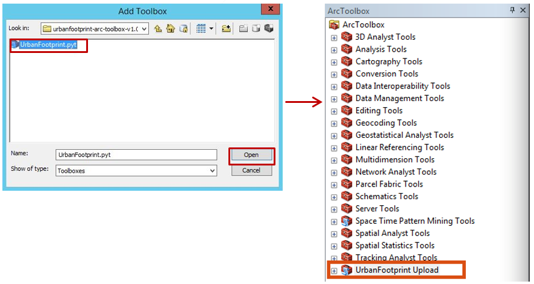
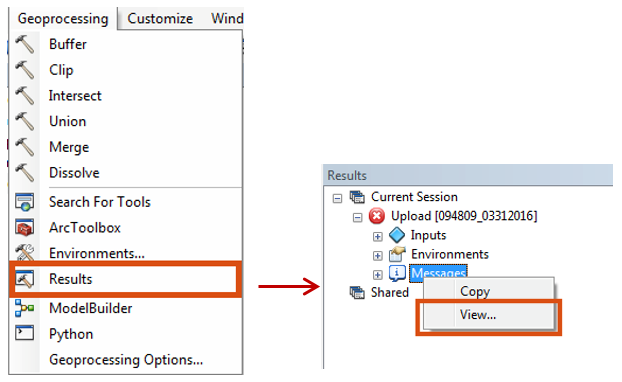
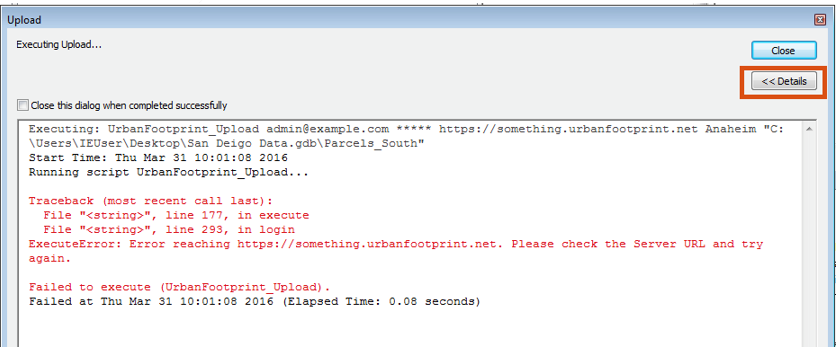

## **IV.	ArcGIS Integration**

This customized python toolbox(.pyt) allows ArcMap users to upload their layers directly to SPM with built in ArcMap functionality.

### **System Requirements/Supported Version**
 - ArcMap 10.3
 - ArcMap 10.4

### **Download**
[ArcToolbox Version 1.0.0](https://s3-us-west-2.amazonaws.com/uf-provisioning/urbanfootprint-arc-toolbox-v1.0.0.zip)

### **Steps to upload a layer using ArcGIS Integration tool**
1. Open ArcMap
2. Navigate to the ArcToolbox section
3. Right click on ArcToolbox and select 'Add Toolbox...'

  

  Figure 19: ArcToolbox

4. Navigate to the ArcGIS Integration tool (ArcToolbox version 1.0.0) and click open. You should now see it at the bottom of your ArcToolbox

  

5. Expand the Upload Toolbox to see Upload tool. To open the dialogue box, double-click the upload tool or right click the tool and click open.  

    

    **Tip:** If you would like the toolbox to appear every time you launch ArcMap, right click on the ArcToolbox again and select Save Settings > To Default

  

6.	Enter all the fields in the dialogue box. The upload tool 5 inputs described below:

  - **Email:** The email address used to login to SPM
  - **Password:** The password used to login to SPM
  - **Server URL:** The URL of SPM (Example: https://spmdm.scag.ca.gov)
  - **Project Name:** The name of the project or jurisdiction in SPM – case sensitive (Example: Anaheim)
  - **Input Feature:** Drag a layer from ArcMap or browse to the layer using the 

7.	After the dialog succeeds, open SPM to see your layer.

**Troubleshooting:** If your layer is not in SPM, please try the following steps:

1.	Navigate to the ‘Results’ section in ArcMap and view the messages.

  

2.	Look for an ‘ExecuteError’ in the messages. In this example, the Server URL is incorrect.

  

3.	Address the issue listed in the messages and try upload again.

  **Hint:** To see the error right away, try showing the ‘Details’ of your toolbox. This dialog pops up after your click OK on the Upload tool.

  
