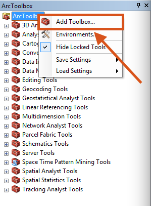
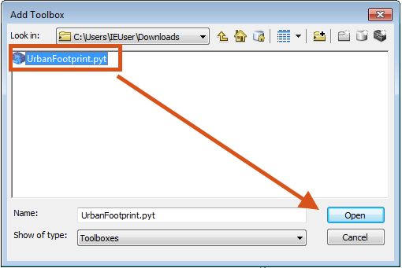
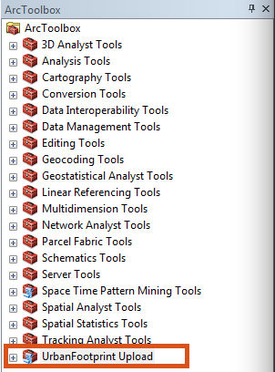
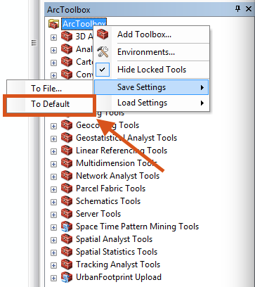
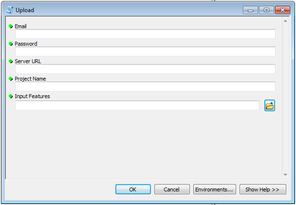
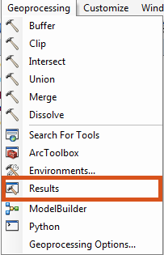
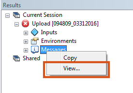
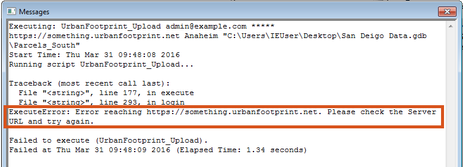
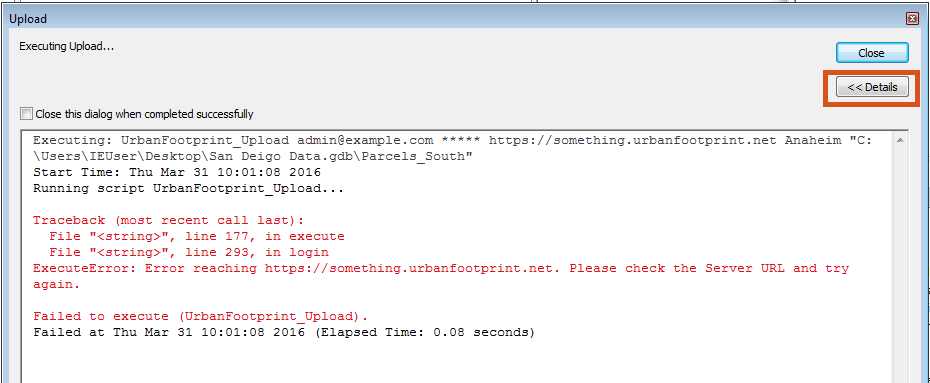

# UrbanFootprint ArcMap Integration Tool

## System Requirements / Supported Version
 - ArcMap 10.3
 - ArcMap 10.4

## Download
[Arc Toolbox Version 1.0.0](https://s3-us-west-2.amazonaws.com/uf-provisioning/urbanfootprint-arc-toolbox-v1.0.0.zip)

## Steps to Download UrbanFootprint Upload Toolbox
1. Open ArcMap
2. Navigate to the ArcToolbox section
3. Right click on ArcToolbox and select 'AddToolbox...'

    

4. Navigate to the Upload toolbox and click open

    

5. You should now see it at the bottom of your ArcToolbox

    

    

***Tip:*** If you would like the toolbox to appear every time you launch ArcMap,
right click on the ArcToolbox again and select Save Settings > To Default

## How to use the UrbanFootprint Upload Toolbox
This customized python toolbox (.pyt) allows ArcMap users to upload their layers
directly to UrbanFootprint with built-in ArcMap functionality.

### UrbanFootprint Upload Toolbox

This ArcMap toolbox has 5 inputs described below:

**Email:** The email address used to login to UrbanFootprint

**Password:** The password used to login to UrbanFootprint

**Server URL:** The url of UrbanFootprint (Example: https://example.urbanfootprint.net)

**Project Name:** The name of the project or jurisdition in UrbanFootprint - *case sensitive* (Example: Anaheim)

**Input Features:** Drag a layer from ArcMap or browse to the layer using the 

### Upload Toolbox Instructions
1. Enter all of the above fields and click OK
2. After the dialog succeeds, open UrbanFootprint
3. Your layer is now in UrbanFootprint!

## Troubleshooting
If your layer is not in UrbanFootprint, please try the following steps:

1. Navigate to the 'Results' section in ArcMap and view the messages.

    
    

2. Look for an 'ExecuteError' in the messages.
In this example, the Server URL is incorrect.

3. Address the issue listed in the messages and try upload again.

***Hint:*** To see the error right away, try showing the 'Details'
of your toolbox. This dialog pops up after you click OK on the
Upload tool.

