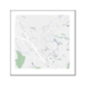
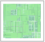
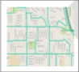
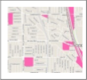
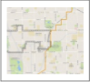
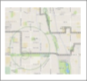
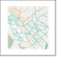

# Data Dictionary

## Basemaps

This group of layers features recent, high-resolution imagery and street maps where
users can select as a base or background layer and identify street and road network
with street names and address search. These layers are ‘served’ directly from
commercial or related services into the SPM system.

 **Mapbox Aerial Photo**

Mapbox’s aerial imagery along with street, building, and other useful labels. 

 **Mapbox Simple Streets**

Mapbox’s streets and related labels, on a standard map.

## Editable Layers

The following layers grouped under Editable Layers present jurisdictional level land use
and modeling boundaries that include editable fields. General Plan, zoning, and existing
land use data are shown at the parcel level. Because SCAG’s parcel level database
does not support multiple uses on a single parcel, data may be generalized in some
areas. Due to this limitation, if site specific data is necessary, users should always
reference a local agency’s adopted documents or field surveys to determine actual land
use designations.

 ***Entitlement Parcels 2016***

Entitlement parcels 2016 are based on the 2012 parcel boundaries and
currently contain no attributes. This layer is prepared to help local
jurisdictions in organizing their entitlement information.

 ***2016 Existing Land Use Parcels***

2016 Existing Land Use Parcels currently reflect the same information as
the 2012 Existing Land Use Parcels (available as reference via SPM) which
incorporate the local inputs received by February 27, 2015. This layer is prepared to
help local jurisdictions in updating their 2012 land use information to 2016 which is the
base year of the 2020-2045 RTP/SCS. For detailed information on the Existing Land
Use codes, please refer to Table C1 in Appendix C. 

 ***General Plan Parcels*** 

The general plan and zoning documents, maps, and/or GIS shapefiles collected
from local jurisdictions were coded into GIS shapefiles at the parcel level. 
Parcel boundary data were acquired from DMP. The General Plan Parcels layer is prepared 
with SCAG’s standardized General Plan codes. For detailed information on the standardized 
general plan codes, please refer to Table C2 in Appendix C. The information available via 
SPM reflects the local inputs received by February 27, 2015. 

 ***Scenario Planning Zones***

Scenario Planning Zone (SPZ) is a spatial boundary that SCAG developed as the minimum 
unit of scenario planning and analysis for the SPM. It was developed by grouping parcels of 
uniform or compatible land uses while maintaining manageable size for capturing local land 
use benefits on transportation, varied by development density and intensity. The SPZs 
maintain a nesting relationship with existing boundaries such as parcel, Tier 2/3 TAZ, 
Community Planning Area, City, Subregion, and County.  

 ***Tier2 TAZ***
 
SCAG developed the Transportation Analysis Zones (TAZ) for the SCAG Region, 
based on the 2010 Tiger Census Block. This is used to facilitate Travel Demand 
and Land Use Modeling needs at SCAG.

## Reference Layers
 
This group of countywide layers includes: (1) 2012 existing land use; (2) resource areas
and farmland (See Government Code section 65080.01 for definitions of “resource areas” and “farmland.”)
information in the region obtained from state and federal data sources; (3) information related to a transit priority project compiled pursuant to Government
Code Section 65080(b)(2)(H); and (4) boundaries of administrative district and Census
geography. 
 
 ***Sphere of Influence***

Sphere of Influence represents the geographic extent to which a
city can expand by annexation. Data was obtained from the Local Agency Formation Commissions (LAFCO) of each county and then
reviewed by local jurisdictions. The information included here is as of February 28,
2015. For inaccuracy or changes in jurisdiction boundaries or
sphere of influences, local jurisdictions need to contact LAFCO to reflect the
most accurate boundaries.
     
 ***Farmland***

Farmland information was obtained from the Farmland Mapping &
Monitoring Program (FMMP) in the Division of Land Resource Protection in the California
Department of Conservation. The FMMP is to provide consistent and 
impartial data and analysis of agricultural land use and land use changes throughout the 
State of California. SCAG obtains the Important Farmland Map created by FMMP, which is updated
biennially based on a computer mapping system, aerial imagery,
public review, and field interpretation. The information was reviewed by local
jurisdictions during the SCAG’s local input process for the 2016-2040 RTP/SCS,
between August 2013 and February 2015, and updated by SCAG staff to incorporate
local jurisdictions’ review comments. The classification system of farmland was developed by combing technical soil rating and current land use, as shown in Table A1. The information available via SPM reflects the 
local inputs received by February 2015.
 
 
### Table A1: Definition of Types of Farmland

| Symbol | Value | Definition |
| -------------------- | -------------------- | -------------------- |
|  | Prime Farmland (P) | Farmland with the best combination of physical and chemical features able to sustain long term agricultural production. This land has the soil quality, growing season, and moisture supply needed to produce sustained high yields. Land must have been used for irrigated agricultural production at some time during the four years prior to the mapping date. |
|  | Farmland of Statewide Importance (S) | Farmland similar to Prime Farmland but with minor shortcomings, such as greater slopes or less ability to store soil moisture. Land must have been used for irrigated agricultural production at some time during the four years prior to the mapping date. |
|  | UNIQUE FARMLAND (U) | Farmland of lesser quality soils used for the production of the state's leading agricultural crops. This land is usually irrigated, but may include non-irrigated orchards or vineyards as found in some climatic zones in California. Land must have been cropped at some time during the four years prior to the mapping date. |
|  | Farmland of Local Importance (L) | Land of importance to the local agricultural economy as determined by each county’s board of supervisors and a local advisory committee. |
|  | Grazing Land (G) | Land on which the existing vegetation is suited to the grazing of livestock. This category was developed in cooperation with the California Cattleman’s Association, University of California Cooperative Extension, and other groups interested in the extent of grazing activities. The minimum mapping unit for Grazing Land is 40 acres. |
|  | Urban and Built-up Land (D) | Land occupied by structures with a building density of at least 1 unit to 1.5 acres, or approximately 6 structures to a 10-acre parcel. This land is used for residential, industrial, commercial, institutional, public administrative purposes, railroad and other transportation yards, cemeteries, airports, golf courses, sanitary landfills, sewage treatment, water control structures, and other developed purposes. |
|  | Other Land (X) | Land not included in any other mapping category. Common examples include low density rural developments; brush, timber, wetland, and riparian areas not suitable for livestock grazing; confined livestock, poultry or aquaculture facilities; strip mines, borrow pits; and water bodies smaller than 40 acres. Vacant and nonagricultural land surrounded on all sides by urban development and greater than 40 acres is mapped as Other Land. |
|  | Water (W) | Perennial water bodies with an extent of at least 40 acres. |
|  | Not Surveyed (Z) | Large government land holdings, including National Parks, Forests, and Bureau of Land Management holdings are not included in FMMP’s survey area. |

 ***CPAD Holdings***

California Protected Area Database (CPAD) is a GIS inventory of all publicly 
owned protected open space lands in the State of California through fee 
ownership. 

The “protected” status in CPAD does not refer to a specific level of conservation for 
biodiversity values, but a general commitment to maintain the property for open space uses. 
The lands in CPAD are defined based on the agencies that own the fee title to the property, 
not the managing parties. Also, CPAD is not the database of all public lands, but that of all 
“publicly owned” open space. The owning agencies include public and non-profits, but 
currently the private owners and properties under the use of easements are excluded. 

The data available via SPM represents CPAD v. 2014a for the six (6) counties in the
SCAG region. The data was reviewed by local jurisdictions during the SCAG’s local
input process for the 2016-2040 RTP/SCS, between August 2013 and February 2015,
and updated by SCAG to incorporated local jurisdictions’ review comments.
The data available via SPM is presented by ownership and reflects the 
local inputs received by February 2015. 

### Table A2: CPAD Holdings by Ownership – Legend
| Symbol | Value |
| -------------------- | -------------------- |
|  | US Forest Service |
|  | US Bureau of Land Management |
|  | National Park Services |
|  | US Fish and Wildlife Service |
|  | Other Federal |
|  | California Department of Parks and Recreation |
|  | California Department of Fish and Wildlife |
|  | Other State |
|  | County |
|  | City |
|  | Non-Governmental Organization |
|  | Special District |
|  | US Military/Defense |

 ***Habitat Conservation Areas***

This data set is from the Natural Community Conservation Planning (NCCP) 
program of California Department of Fish and Wildlife. The primary objective 
of the NCCP program is to conserve natural communities at the ecosystem 
level, while accommodating compatible land use. By considering the long-term stability of 
wildlife and plant communities, and including key interests in the planning process, it aims 
at anticipating and preventing the controversies in the surrounding areas of the species.
 
A local agency is in charge of monitoring the development of a conservation plan in 
cooperation with landowners, environmental organizations and other interest parties.  The 
Department of Fish and Wildlife provides necessary support, direction, and guidance to 
NCCP participants. 

 ***Endangered Species***

SCAG obtained the California Natural Diversity Database (CNDDB) July 2013 
version developed by the California Department of Fish and Wildlife’s 
Biogeographic Data Branch (BDB). The CNDDB is a library of the location and 
condition of species of rate and sensitive plants, animals, and natural communities in 
California. It is updated on a continuous basis to be consistent and current, but cannot be an 
exhaustive and comprehensive inventory of rare species and natural communities. Field 
verification for the absence and presence of sensitive species is required by the end users.
  
The types of elements are specified as four categories of plant, animal, 
terrestrial community, and aquatic community, as shown in the Table A3. 

### Table A3: Definition of Types of Elements (ELMTYPE)

| Symbol | Value | Definition |
| -------------------- | -------------------- | -------------------- |
|  | 1 | Plant (ELMCODEs beginning with “P” or “N”) |
|  | 2 | Animal (ELEMCODEs beginning with “A” or “I”) |
|  | 3 | Terrestrial community (ELMCODEs beginning with “CT”) |
|  | 4 | Aquatic community (ELMCODEs beginning with ”CA”, “CE”, CL”, “CM” or “CR” |

The precision or accuracy level (ACC_CLASS) represents spatial uncertainty on a scale of
one to ten, indicating both accuracy type and accuracy value. 

### Table A4: Definition of Precision or Accuracy Level (ACC_CLASS)

| Value | Definition |
| -------------------- | -------------------- |
| 80 meters | 1: Specific bounded area with an 80 meter radius |
| Specific | 2: Specific bounded area |
| Nonspecific | 3: Non-specific bounded area |
| 1/10 mile | 4: Circular feature with a 150 meter radius (1/10 mile) |
| 1/5 mile | 5: Circular feature with a 300 meter radius (1/5 mile) |
| 2/5 mile | 6: Circular feature with a 600 meter radius (2/5 mile) |
| 3/5 mile | 7: Circular feature with a 1,000 meter radius (3/5 mile) |
| 4/5 mile | 8: Circular feature with a 1,300 meter radius (4/5 mile) |
| 1 mile | 9: Circular feature with a 1,600 meter radius (1 mile) |
| 5 mile | 10: Circular feature with a 8,000 meter radius (5 miles) |

 ***Major Transit Stops***

Major Transit Stop is a site containing a rail transit station, a ferry
terminal served by either a bus or rail transit service, or the intersection of two or more
major bus routes with a frequency of service interval of 15 minutes or less during the
morning and afternoon peak commute periods (CA Public Resource Code Section 21064.3).
This is the draft major transit stops in the SCAG region for base year 2012, updated as of
August 14, 2015. Please note this dataset may undergo changes as SCAG continues to
update its transportation network.

 ***High Quality Transit Corridors***

High Quality Transit Corridors (HQTC) is a corridor with fixed route bus service with
service intervals no longer than 15 minutes during peak commute hours. This is the draft HQTC in the
SCAG region for base year 2012, updated as of August 14, 2015. Please note this dataset may undergo changes
as SCAG continues to update its transportation network.  

 ***High Quality Transit Areas***

High Quality Transit Area (HQTA) is an area within one-half-mile of either a well-serviced transit stop or a
transit corridor with 15 minutes or less service frequency during peak commute hours. This is the draft HQTA in the
SCAG region for base year 2012, updated as of September 28, 2015. Please note this
dataset may undergo changes as SCAG continues to update its transportation
network.

 ***Transit Priority Areas***

Transit Priority Area (TPA) is an area within one-half mile of a major transit stop that
is existing or planned, if the planned stop is scheduled to be completed within the planning horizon 
included in a Transportation Improvement Program adopted pursuant to
Section 450.216 or 450.332 of Title 23 of the Code of Federal Regulations. This is the draft TPA for base
year 2012, updated as of September 2015. Please note this dataset
may undergo changes as SCAG continues to update its transportation
network.

 ***Census Tracts***

Census Tracts are small, relatively permanent statistical subdivisions of a
county or equivalent entity, and were defined by local participants as part of
the 2010 Census Participant Statistical Areas Program. The Census Bureau delineated the
census tracts in situations where no local participant existed or where all the potential
participants declined to participate. The primary purpose of census tracts is to provide a
stable set of geographic units for the presentation of census data and comparison back
to previous decennial censuses. Census tracts generally have a population size
between 1,200 and 8,000 people, with an optimum size of 4,000 people. The spatial
size of census tracts varies widely depending on the density of settlement.

 ***Sub Region***

This dataset contains the official subregional boundaries for the SCAG
region. The data has been updated as of August 2013 to incorporate
changes in Western Riverside Council of Governments (WRCOG) and Coachella Valley
Association of Governments (CVAG) in the County of Riverside. All subregional boundaries
are consistent with the 2012 city boundaries whenever they overlap.

 ***Bike Lane***

This dataset contains existing (current) and proposed
(future) bike routes, per route class, within the SCAG region. Regional Bike
Network (RBN) is included in this dataset. The Imperial and Ventura County bike routes
have been re-aligned to better match the street network. The majority of the data are for
year 2012 or 2011, except Orange County which is for 2014.

 ***Sea Level Rise***

The purpose of this dataset is to show potential sea level
rise inundation 5 feet above current Mean Higher High Water (MHHW) for
the area. This data was created as part of the National Oceanic and Atmospheric
Administration (NOAA) Coastal Services Center’s efforts to create an online mapping
viewer depicting potential sea level rise and its associated impacts on the nation’s
coastal areas. The Sea Level Rise and Coastal Flooding Impacts Viewer may be
accessed at http:///www.csc.noaa.gov/slr This dataset was derived from two different
data sources: the Digital Elevation Model (DEM) of the area and a tidal surface model
that represents spatial tidal variability. 

 ***City Boundary***

This dataset includes the updated as of August 29,
2014 city boundaries for all SCAG counties. Data was obtained from the Local Agency
Formation Commissions (LAFCO) of each county and then reviewed by local
jurisdictions during the Local Input process, between March 2013 and August 2014, to
reflect the most current updates and annexations to the city boundaries.

 ***2012 Existing Land Use Parcels***

To develop the base year existing land use data, SCAG used property land use information acquired
from Digital Map Products (DMP) and SCAG’s 2008 existing land use data. DMP land use
codes were converted to SCAG’s standardized Existing Land Use code system. For detailed
information on the Existing Land Use codes, please refer to Table C1 in Appendix C.

Beginning in August 2013, the 2012 existing land use maps were reviewed by local
jurisdictions and revised based on the local input and comments. The information available
via SPM reflects the local inputs received by February 27, 2015 and provided for reference in development 
of 2016 Existing Land Use.

