## **Appendix A - Data Dictionary**

### **_Basemaps_**

This group of layers features recent, high-resolution imagery and street maps where users can select as a base or background layer and identify street and road network with street names and address search. These layers as ‘served’ directly from commercial or related services into the SPM system.

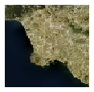 _Mapbox Aerial Photo_

Mapbox’s aerial imagery along with street, building, and other useful labels.

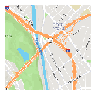 _Mapbox Simple Streets_

Mapbox’s streets and related labels, on a standard map.

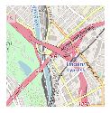 _Open Street Map_

Streets and related labels on a standard map served by OpenStreetMap.

### **_Editable Layers_**

The following layers grouped under Editable Layers present jurisdictional level land use and modeling boundaries that include editable fields. General Plan, zoning, existing land use, specific plan, entitlement and infill opportunity data are shown at the parcel level. Because SCAG’s parcel level database does not support multiple uses on a single parcel, data may be generalized in some areas. Due to this limitation, if site specific data is necessary, users should always reference a local agency’s adopted documents or field surveys to determine actual land use designations.

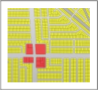 _2016 SCAG Existing Land Use Parcels_

The base year of the 2020 RTP/SCS is 2016. To develop the base year existing land use data, SCAG has used property land use information acquired from DMP and SCAG’s 2016 existing land use data. Using a correspondence between DMP land use codes and SCAG’s standardized 2016 Land Use Codes, DMP land use codes were converted to SCAG Land Use Code system. As noted for general plan land use and zoning data, existing land use data are shown at the parcel level and, in some areas, data may be generalized, because SCAG’s parcel level database does not support multiple uses on a single parcel. Due to this limitation, if site specific data is necessary, users should always reference a local agency’s adopted documents or field surveys to determine actual land use designations. For detailed information on the Land Use codes, please refer to Appendix C.

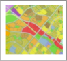 _2016 SCAG General Plan Land Use & Zoning Parcels_

Beginning in March 2017, SCAG collected local general plan land use and zoning information. Through the process of collecting general plan and zoning documents, SCAG staff made every effort to ensure the data reflects the most current general plan land use and zoning data. The general plan land use and zoning documents, maps, and/or GIS files collected were coded into GIS format at the parcel level. Parcel boundary data were acquired from county assessor’s offices. General plan land use and zoning data are shown at the parcel level and depict a local agency’s adopted documents. However, the data shown in some areas may be generalized, because the parcel level database representing general plan land use and zoning data does not support multiple uses or designations on a single parcel (either splitting the parcel or representing overlays). Due to this limitation, if site specific data is necessary, users should always reference a local agency’s adopted documents or field surveys to determine actual land use designations. At the jurisdiction level, both general plan land use and zoning maps are prepared with local land use or zoning codes, consistent with those used in each local jurisdiction, as well as with the SCAG’s standardized 2016 Land Use Codes. For detailed information on the standardized Land Use codes, please refer to Appendix C.

 _2016 SCAG Specific Plan Parcels_

Beginning in August 2016, SCAG collected local specific plan land use information. Through the process of collecting specific plan documents, SCAG staff made every effort to ensure the data reflects the most current specific plan land use data. The specific plan land use documents, maps, and/or GIS files collected were coded into GIS format at the parcel level. Parcel boundary data were acquired from county assessor’s offices. Specific plan land use data are shown at the parcel level and depict a local agency’s adopted documents. As noted for general plan land use and zoning data, specific plan land use data are shown at the parcel level and, in some areas, data may be generalized, because SCAG’s parcel level database does not support multiple uses on a single parcel. Due to this limitation, if site specific data is necessary, users should always reference a local agency’s adopted documents or field surveys to determine actual land use designations.

 _2016 Entitlement Parcels_

Based on feedback from stakeholders, SCAG convened the Entitlement Working Group comprised of professionals in the building industry and development services to help inform the update of local data for use in the 2020 RTP/SCS and Regional Housing Needs Assessment (RHNA).

The objectives of the working group include:

• Assessing and enhancing SCAG’s current entitlement database, specifically with regard to the density, intensity, and phasing of future development projects,

• Providing feedback on how best to engage with stakeholders to ensure the accuracy of SCAG’s local data, and

• Starting to build the foundation to develop the “Shared Vision” in growth forecast and land use for the 2020 RTP/SCS.

SCAG established its regional entitlement database based on inputs provided by this working group. Maps were made separately for better presentation of the entitlement projects and available for local jurisdiction’s review at http://scagrtpscs.net/Pages/DataMapBooks.aspx. It should be noted that the entitlement data will be further reviewed and updated as SCAG continue to receive input and comments from subregions and local jurisdictions during the Local Input & Envisioning Process for the 2020 RTP/SCS.

 _Parcels with Potential Infill Opportunity_

In 2005, the Institute of Urban and Regional Development (IURD) at University of California, Berkeley, conducted the statewide infill study, designed to provide an assessment of infill opportunities, a robust estimate of how many housing units might reasonably be built on available infill sites, and an evaluation of the critical market and policy gaps that remain to be filled. Amongst the objectives of the IURD’s infill study is to develop a statewide, parcel-based inventory of potential infill sites. The study identified infill sites as vacant or potentially redevelopable parcels located in existing urban neighborhoods, based on an analysis of county assessors’ parcel data. A vacant parcel is defined as one that has no inhabitable structure or building, or is currently not in use for extractive purposes. Sites with structures too small to be inhabited, or for which the structure value is too small, are also deemed to be vacant. To be counted as infill-ready, a vacant parcel must also be privately owned and available and feasible for potential urban development. Redevelopable parcels, or henceforth, refill parcels, are privately owned, previously-developed parcels, but for which the improvement-value-to-land value (I/L) ratio is less than 1.0 for commercial and multi-family properties, and less than 0.5 for single-family properties.

To conduct the infill analysis for the SCAG Region, the similar approach was applied to identify potential infill sites by using the most recent county assessor’s property information obtained from the Digital Map Product (DMP) in October 2016. Additionally, SCAG utilized SCAG’s regional land use datasets and publicly available reference information, including but not limited to: California Protected Areas Database (CPAD), California Conservation Easement Database (CCED), California School Campus Database (CSCD) and important farmlands from Farmland Mapping and Monitoring Program (FMMP). Please note the quality of assessors’ parcel data varies by county, with land and structure assessments based on older transactions being particularly problematic, especially for properties that were last sold prior to 1990, or for properties that were renovated but not reassessed. It may seem fairly reasonable to believe that this study overestimates the number of potential infill parcels primarily due to inaccurate or outdated assessor’s property information. It is quite possible that many of the parcels identified as possibly economically underutilized, and therefore ripe for infill development, may be neither physically deteriorated nor economically under-valued. Based on the approach used to identify the infill sites, it is not known which, if any, of the identified infill sites might be made available by their current owners for sale or development. Therefore, it should be noted that the analysis presented in this study is essentially a starting point for more detailed analyses to be undertaken in collaboration with local governments and will be further reviewed and updated as SCAG continue to receive input and comments from subregions and local jurisdictions during the Local Input & Envisioning Process for the 2020 RTP/SCS.

 _Tier2 TAZ_

SCAG developed the Transportation Analysis Zones (TAZ) for the SCAG Region. This is used to
facilitate Travel Demand and Land Use Modeling needs at SCAG. For jurisdictions in San Bernardino County, Tier 3 TAZ boundaries are available instead of Tier 2 TAZ.

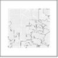 _City Boundary_

The city boundary information included here are as of August 2016, the base year for the 2020 RTP/SCS The dataset is comprised of data collected from each of the 6 counties contained within the SCAG region. The data represents the city boundary for each of the 191 cities in the region. Data was obtained from county LAFCOs (except for Imperial County) to reflect the most current updates and annexations to the city boundaries. The original data sources were the local LAFCO offices and County Assessor’s Office (for Imperial County cities ONLY).

### **_Reference Layers_**

This group of layers includes: (1) Scenario Planning Zone (SPZ) boundaries; (2) resource areas and farmland  information in the region obtained from state and federal data sources; (3) information related to a transit priority project compiled pursuant to Government Code Section 65080(b)(2)(H); and (3) boundaries of administrative district and Census geography.  

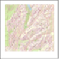 _Scenario Planning Zones_

Scenario Planning Zone (SPZ) is a spatial boundary that SCAG developed as the minimum unit of scenario planning and analysis for the SPM. It was developed by grouping parcels of uniform or compatible land uses while maintaining manageable size for capturing local land use benefits on transportation, varied by development density and intensity. The SPZs maintain a nesting relationship with existing boundaries such as parcel, Tier 2/3 TAZ, Community Planning Area, City, Subregion, and County.

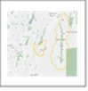 _Sphere of Influence_

The Sphere of Influence information represents the geographic extent to which a city can expand by annexation. Data was obtained from the Local Agency Formation Commission (LAFCO) of each county. For inaccuracy or changes in sphere of influences, local jurisdictions need to contact LAFCO to reflect the most accurate boundaries.

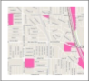 _Farmland_

Farmland information was obtained from the Farmland Mapping & Monitoring Program (FMMP) in the Division of Land Resource Protection in the California Department of Conservation. Established in 1982, the FMMP is to provide consistent and impartial data and analysis of agricultural land use and land use changes throughout the State of California. The FMMP updates and releases the Important Farmland Map by county every two years and SCAG obtained the most up-to-date version. The study area is in accordance to the soil survey developed by NRCS (National Resources Conservation Service) in the United States Department of Agriculture. Important Farmland Map is biennially updated based on a computer mapping system, aerial imagery, public review, and field interpretation. The minimum land use mapping unit is 10 acres. The classification system of the map was developed by combining technical soil rating and current land use. For more information, refer to the website at http://www.conservation.ca.gov/dlrp/fmmp/Pages/Index.aspx.

The classification system of farmland was developed by combing technical soil rating and current land use, as shown in Table A1.

#### **Table A1: Definition of Types of Farmland**

| Symbol | Value | Definition |
| -------------------- | -------------------- | -------------------- |
|  | Prime Farmland (P) | Farmland with the best combination of physical and chemical features able to sustain long term agricultural production. This land has the soil quality, growing season, and moisture supply needed to produce sustained high yields. Land must have been used for irrigated agricultural production at some time during the four years prior to the mapping date. |
|  | Farmland of Statewide Importance (S) | Farmland similar to Prime Farmland but with minor shortcomings, such as greater slopes or less ability to store soil moisture. Land must have been used for irrigated agricultural production at some time during the four years prior to the mapping date. |
|  | UNIQUE FARMLAND (U) | Farmland of lesser quality soils used for the production of the state's leading agricultural crops. This land is usually irrigated, but may include non-irrigated orchards or vineyards as found in some climatic zones in California. Land must have been cropped at some time during the four years prior to the mapping date. |
|  | Farmland of Local Importance (L) | Land of importance to the local agricultural economy as determined by each county’s board of supervisors and a local advisory committee. |
|  | Grazing Land (G) | Land on which the existing vegetation is suited to the grazing of livestock. This category was developed in cooperation with the California Cattleman’s Association, University of California Cooperative Extension, and other groups interested in the extent of grazing activities. The minimum mapping unit for Grazing Land is 40 acres. |
|  | Urban and Built-up Land (D) | Land occupied by structures with a building density of at least 1 unit to 1.5 acres, or approximately 6 structures to a 10-acre parcel. This land is used for residential, industrial, commercial, institutional, public administrative purposes, railroad and other transportation yards, cemeteries, airports, golf courses, sanitary landfills, sewage treatment, water control structures, and other developed purposes. |
|  | Other Land (X) | Land not included in any other mapping category. Common examples include low density rural developments; brush, timber, wetland, and riparian areas not suitable for livestock grazing; confined livestock, poultry or aquaculture facilities; strip mines, borrow pits; and water bodies smaller than 40 acres. Vacant and nonagricultural land surrounded on all sides by urban development and greater than 40 acres is mapped as Other Land. The Rural Land Mapping Project provides more detail on the distribution of various land uses within the Other Land category. The Rural Land categories include: Rural Residential Land (R), Semi-Agricultural and Rural Commercial Land (sAC), Vacant or Disturbed Land (V), Confined Animal Agriculture (Cl), and Nonagricultural or Natural Vegetation (nv). |
|  | Water (W) | Perennial water bodies with an extent of at least 40 acres. |
|  | Not Surveyed (Z) | Large government land holdings, including National Parks, Forests, and Bureau of Land Management holdings are not included in FMMP’s survey area. |

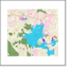 _CPAD Holdings_

The database is prepared into three feature classes; Holdings, Units, and Super Units. Holdings are the parcel level open space information, which correspond to assessor or tax parcel boundaries. Units and Super Units are the aggregated features for the cartographic representation. (Units: the aggregation of Holdings into specific parks and reserves / Super Units: the aggregation of federal and state Holdings regardless county boundaries) All classes of data are downloadable through their website at http://www.calands.org. For user constraints, refer to the License Agreement.
GreenInfo Network has released several versions of the CPAD since March, 2008. The most up-todate version is CPAD v.2017a, which was released in August, 2017. For more information on CPAD update histories and changes, see their website at http://www.calands.org/data.

#### **Table A2: CPAD Holdings by Ownership – Legend**

| Symbol | Value |
| -------------------- | -------------------- |
|  | US Forest Service |
|  | US Bureau of Land Management |
|  | National Park Services |
|  | US Fish and Wildlife Service |
|  | Other Federal |
|  | California Department of Parks and Recreation |
|  | California Department of Fish and Wildlife |
|  | Other State |
|  | County |
|  | City |
|  | Non-Governmental Organization |
|  | Special District |
|  | US Military/Defense |

 _Habitat Conservation Areas_

The data on natural community and habitat conservation plan are from the Natural Community Conservation Planning (NCCP) program of California Department of Fish and Wildlife. With partnerships with public and private organizations, NCCP is an effort for the protection and perpetuation of biological diversity, while allowing compatible and appropriate economic activity. The NCCP program started in 1991 under the State’s Natural Community Conservation Planning Act, which has broader orientation and objectives than the previous laws limited to the protection of species already declined in number significantly.

The primary objective is to conserve natural communities at the ecosystem level, while accommodating compatible land use. By considering the long-term stability of wildlife and plant communities, and including key interests in the planning process, it aims at anticipating and preventing the controversies in the surrounding areas of the species.

A local agency is in charge of monitoring the development of a conservation plan in cooperation with landowners, environmental organizations and other interest parties. The Department of Fish and Wildlife provides necessary support, direction, and guidance to NCCP participants.3 For more information on the NCCP phases and guidance, refer to their website at https://www.wildlife.ca.gov/Conservation/Planning/NCCP.

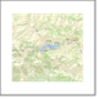 _Endangered Species_

SCAG obtained the California Natural Diversity Database (CNDDB) 1 October 2017 version
developed by the California Department of Fish and Wildlife’s Biogeographic Data Branch (BDB). The CNDDB is a library of the location and condition of species of rare and sensitive plants, animals, and natural communities in California. It is updated on a continuous basis to be consistent and current, but cannot be an exhaustive and comprehensive inventory of rare species and natural communities. Field verification for the absence and presence of sensitive species is required by the end users.

The dataset is shown on the map is based on the combination of the three data fields; element type, accuracy and element occurrence count. Other fields in CNDDB describe the listing status, ranking, location, site description and source references, to name a few.

The types of elements are specified as four categories of plant, animal, terrestrial community, and aquatic community, as shown in the Table A3.

#### **Table A3: Definition of Types of Elements (ELMTYPE)**

| Symbol | Value | Definition |
| -------------------- | -------------------- | -------------------- |
|  | 1 | Plant (ELMCODEs beginning with “P” or “N”) |
|  | 2 | Animal (ELEMCODEs beginning with “A” or “I”) |
|  | 3 | Terrestrial community (ELMCODEs beginning with “CT”) |
|  | 4 | Aquatic community (ELMCODEs beginning with ”CA”, “CE”, CL”, “CM” or “CR” |

The precision or accuracy level (ACC_CLASS) represents spatial uncertainty on a scale of one to ten, indicating both accuracy type and accuracy value.

#### **Table A4: Definition of Precision or Accuracy Level (ACC_CLASS)**

| Value | Definition |
| -------------------- | -------------------- |
| 80 meters | 1: Specific bounded area with an 80 meter radius |
| Specific | 2: Specific bounded area |
| Nonspecific | 3: Non-specific bounded area |
| 1/10 mile | 4: Circular feature with a 150 meter radius (1/10 mile) |
| 1/5 mile | 5: Circular feature with a 300 meter radius (1/5 mile) |
| 2/5 mile | 6: Circular feature with a 600 meter radius (2/5 mile) |
| 3/5 mile | 7: Circular feature with a 1,000 meter radius (3/5 mile) |
| 4/5 mile | 8: Circular feature with a 1,300 meter radius (4/5 mile) |
| 1 mile | 9: Circular feature with a 1,600 meter radius (1 mile) |
| 5 mile | 10: Circular feature with a 8,000 meter radius (5 miles) |

The element occurrence count (EOCOUNT) represents how many occurrences share the same spatial feature. An EOCOUNT greater than one indicates the presence of a “multiple.”
For more information on the CNDDB, please refer to their website (https://www.wildlife.ca.gov/Data/CNDDB). The CNDDB is offered on a yearly subscription basis, and is prohibited from being distributed to anyone outside the subscribing organizations. The data can be ordered online at https://www.wildlife.ca.gov/Data/CNDDB/Maps-and-Data. Also, the web-based CNDDB QuickView Tool which provides users with a list of all tracked elements that have been documented by the CNDDB to occur in a selected USGS 7.5’ topographic quad or in a selected county is available at https://www.wildlife.ca.gov/Data/CNDDB/Maps-and-Data#43018410-cnddb-quickview-tool.

 _Flood Zones_

The flood area maps are based on the Digital Flood Insurance Rate Map (DFIRM), obtained from Federal Emergency Management Agency (FEMA) in August 2017. The DFIRM Database is a
digital version of the FEMA Flood Insurance Rate Maps (FIRM)2 that is designed for use with digital mapping and analysis software. The FIRM is created by FEMA for the purpose of floodplain management, mitigation, and insurance activities for the National Flood Insurance Program (NFIP).

FEMA prepares the flood maps to show the extent of flood hazard in a flood prone community by conducting engineering studies called “Flood Insurance Studies (FISs). From the study, FEMA delineate Special Flood Hazard Areas (SFHAs), which are subject to inundation by a flood that has a 1 percent or greater chance of being equaled or exceeded during any given year. This type of flood is commonly referred to as ‘the 100-year flood’ or base flood. The 100-year flood has a 26 percent chance of occurring during a 30 year period, the length of many mortgages. The 100-year flood is a regulatory standard used by Federal and most State agencies to administer floodplain management programs.

The FIRM includes data on the 100-year (1% annual chance of occurring) and 500-year (0.2% annual chance of occurring) floodplains. The flood maps developed by FEMA are primary tools for state and local governments to mitigate the effects of flooding in their communities. The data are available to the public at FEMA’s Map Service Center (https://msc.fema.gov/portal/). You may also request the related documents or other maps, such as FIS result report, or a Flood Boundary and Floodway Map (FBFM). For more information on the FIRM, refer to their website at https://www.fema.gov/flood-insurance-rate-map-firm.

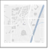 _Major Transit Stops_

A site containing an existing rail transit station, a ferry terminal served by either a bus or rail transit service, or the intersection of two or more major bus routes with a frequency of service interval of 15 minutes or less during the morning and afternoon peak commute periods (CA Public Resource Code Section 21064.3). It also includes major transit stops that are included in the applicable regional transportation plan.

Please note that this map may undergo changes as SCAG continues to update its transportation network as part of the 2020 RTP/SCS development process and SCAG shall not be responsible for local jurisdiction’s use of this map. Updates to this information will be forthcoming as information becomes available.

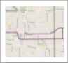 _High Quality Transit Corridors_

A corridor with fixed route Transitbus service with service intervals no longer than 15 minutes during peak commute hours.

Please note that this map may undergo changes as SCAG continues to update its transportation network as part of the 2020 RTP/SCS development process and SCAG shall not be responsible for local jurisdiction’s use of this map. Updates to this information will be forthcoming as information becomes available.

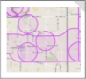 _High Quality Transit Areas_

SCAG’s High Quality Transit Area (HQTA) is within one-half mile from major transit stops and high quality transit corridors and developed based on the language in SB375. This is the HQTA in the SCAG Region for planned year 2040, extracted from are extracted from the 2016-2040 RTP/SCS Amendment #2 2040 planned year transit network data. The definition that SCAG has been using for the HQTA is based on the language in SB375.

Please note that this map may undergo changes as SCAG continues to update its transportation network as part of the 2020 RTP/SCS development process and SCAG shall not be responsible for local jurisdiction’s use of this map. Updates to this information will be forthcoming as information becomes available.

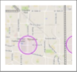 _Transit Priority Areas_

As defined in SB 743, “Transit Priority Area” means an area within one-half mile of a major transit stop that is existing or planned, if the planned stop is scheduled to be completed within the planning horizon included in a Transportation Improvement Program adopted pursuant to Section 450.216 or 450.322 of Title 23 of the Code of Federal Regulations.

To assist in identifying the transit priority areas, SCAG identifies the major transit stops and their surrounding areas in one-half mile radius distance. Major transit stops are extracted from 2040 plan year data of the 2016-2040 RTP/SCS Amendment #2 and modified by inputs from transit operators and local jurisdictions.This inventory is based on available information at the time regarding existing and planned transit service. However, transit agencies make adjustments to bus service on a regular basis. Local jurisdictions are encouraged to consult with their appropriate transit provider(s) to obtain the latest information on existing transit routes and frequencies.

Please note that this map may undergo changes as SCAG continues to update its transportation network as part of the 2020 RTP/SCS development process and SCAG shall not be responsible for local jurisdiction’s use of this map. Updates to this information will be forthcoming as information becomes available.

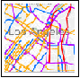 _Bike Lanes_

The Southern California Regional Bikeway Shapefile (RBS) has been compiled in coordination with each of the six County Transportation Commissions (Imperial, Orange, Los Angeles, Riverside, San Bernardino, and Ventura). SCAG has developed standard data fields using existing fields from each county and others identified by stakeholders and consultants. Definitions of each field can be found in the data dictionary for the project which is currently under development.

The RBS includes both existing and planned facilities and was compiled from shapefiles provided by each county transportation commission. Commissions use different strategies for compiling their files so some counties may be more up to date and contain different amounts of data than others. Existing routes are facilities that currently are installed upon city streets or paths. Planned facilities are those contained in city or county level plans that have not yet been constructed. Each route is classified based on definitions for bicycle routes as outlined below. Class 1-4 are defined by the California Highway Design Manual. Class 5 is a SCAG defined route type.

Class Definitions:

• Class I Bikeway (Bike Path): Provides a completely separated facility for the exclusive use of bicycles and pedestrians with crossflow by vehicles minimized.

• Class II Bikeway (Bike Lane): Provides a striped lane for one-way bike travel on a street or highway.

• Class III Bikeway (Bike Route): Provides for shared use with pedestrian or motor vehicle traffic.

• Class IV Bikeway (Separated Bikeway): Provides for the exclusive use of bicycles and includes a separation (e.g., grade separation, flexible posts, inflexible physical barrier, or onstreet parking) required between the separated bikeway and the through vehicular traffic.

• Class V Bikeway (Bicycle Friendly Boulevard): Bicycle Friendly Boulevard are facilities parallel to major corridors and that provide a calmer, safer alternative for bicyclists of all ages and skill levels. Bicycle Friendly Streets include traffic calming elements beyond traditional signage, such as roundabouts, diverters, curb extensions, etc.

 _Truck Routes_

The Southern California Regional Truck Route Shapefile (RTRS) has been compiled using the general plans and municipal codes of the jurisdictions in areas of each of the six County Transportation Commissions (Imperial, Orange, Los Angeles, Riverside, San Bernardino, and Ventura). SCAG has developed standard data fields based on information found in local general plan and municipal codes to identify roadways and roadway segments that are designated as truck routes by the cities.

The RTRS includes truck routes on existing local facilities. Jurisdictions use different criteria (e.g., weight, axles, time of day, etc.) to designate a truck route for their city. For the purposes of the RTRS, weight was used as the factor to determine truck route locations as this was the most commonly used criterion. Existing truck routes are those that are specifically identified as facilities where trucks are generally permitted during all times, or the majority, of a day. It should be recognized that most jurisdictions permit truck to travel on any roadway segment with clear limitations to their movement (e.g., direct delivery to locations not on a designated route). Each route is at the discretion of its jurisdiction. Confirmation and updates to the RTRS will allow SCAG member cities to understand and develop policy regarding intra-city and intercity truck route connections and gaps, and connections to industrial uses within jurisdictional boundaries.

 _Census Tracts_

Census Tracts are small, relatively permanent statistical subdivisions of a county or equivalent entity, and were defined by local participants as part of the 2010 Census Participant Statistical Areas Program. The Census Bureau delineated the census tracts in situations where no local participant existed or where all the potential participants declined to participate. The primary purpose of census tracts is to provide a stable set of geographic units for the presentation of census data and comparison back to previous decennial censuses. Census tracts generally have a population size between 1,200 and 8,000 people, with an optimum size of 4,000 people. The spatial size of census tracts varies widely depending on the density of settlement.

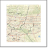 _Sub Region_

This dataset contains the official subregional boundaries for the SCAG region. The data has been updated as of August 2013 to incorporate changes in Western Riverside Council of Governments (WRCOG) and Coachella Valley Association of Governments (CVAG) in the County of Riverside.

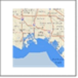 _Sea Level Rise 2ft_

The Coastal Inundation data were obtained from the National Oceanic and Atmospheric Administration (NOAA) Coastal Services Center’s online mapping viewer depicting potential sea level rise and its associated impacts on the nation’s coastal areas. These data depict the potential inundation of coastal areas resulting from a projected 2 feet rise in sea level above current Mean Higher High Water (MHHW) conditions.

The process used to produce the data can be described as a modified bathtub approach that attempts to account for both local/regional tidal variability as well as hydrological connectivity. The process uses two source datasets to derive the final inundation rasters and polygons and accompanying low-lying polygons for each iteration of sea level rise: the Digital Elevation Model (DEM) of the area and a tidal surface model that represents spatial tidal variability. The tidal model is created using the NOAA National Geodetic Survey’s VDATUM datum transformation software (http://vdatum.noaa.gov) in conjunction with spatial interpolation/extrapolation methods and represents the MHHW tidal datum in orthometric values (North American Vertical Datum of 1988). The model used to produce these data does not account for erosion, subsidence, or any future  changes in an area’s hydrodynamics. It is simply a method to derive data in order to visualize the potential scale, not exact location, of inundation from sea level rise.

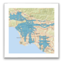_HQTA 2016_

This is the draft High Quality Transit Areas (HQTA) in the SCAG Region for the year 2016, updated as of June 2019. SCAG’s HQTA is within one-half mile from major transit stops and high quality transit corridors and developed based on the language in SB375. The definitions of major transit stops and high quality transit corridors are as follows: 

A. Major Transit Stop: A site containing an existing rail transit station, a ferry terminal served by either a bus or rail transit service, or the intersection of two or more major bus routes with a frequency of service interval of 15 minutes or less during the morning and afternoon peak commute periods (CA Public Resource Code Section 21064.3). It also includes major transit stops that are included in the applicable regional transportation. 

B. High-Quality Transit Corridor (HQTC): A corridor with fixed route bus service with service intervals no longer than 15 minutes during peak commute hours. Major transit stops and high quality transit corridors are extracted from 2016 base year data of the Connect SoCal, the 2020-2045 Regional Transportation Plan/Sustainable Communities Strategy (RTP/SCS), and modified by inputs from transit operators. Please note that transit agencies make adjustments to bus service on a regular basis, and therefore, users are encouraged to consult with their appropriate transit provider(s) to obtain the latest information on existing transit routes and frequencies. This dataset may undergo changes as SCAG continues to update its transportation network and SCAG shall not be responsible for local jurisdiction's use of this map.

This inventory is based on available information at the time regarding existing and planned transit service. However, transit agencies make adjustments to bus service on a regular basis. Users are encouraged to consult with their appropriate transit provider(s) to obtain the latest information on existing transit routes and frequencies. Please note this dataset may undergo changes as SCAG continues to update its transportation network and SCAG shall not be responsible for local jurisdiction's use of this map.|

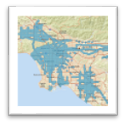_HQTA 2045_

This is the draft High Quality Transit Areas (HQTA) in the SCAG Region for the 2045 Plan, updated as of June 2019. SCAG’s HQTA is within one-half mile from major transit stops and high quality transit corridors and developed based on the language in SB375. The definitions of major transit stops and high quality transit corridors are as follows:

A. Major Transit Stop: A site containing an existing rail transit station, a ferry terminal served by either a bus or rail transit service, or the intersection of two or more major bus routes with a frequency of service interval of 15 minutes or less during the morning and afternoon peak commute periods (CA Public Resource Code Section 21064.3). It also includes major transit stops that are included in the applicable regional transportation. 

B. High-Quality Transit Corridor (HQTC): A corridor with fixed route bus service with service intervals no longer than 15 minutes during peak commute hours.
Major transit stops and high quality transit corridors are extracted from 2045 plan year data of the Connect SoCal, the 2020-2045 Regional Transportation Plan/Sustainable Communities Strategy (RTP/SCS), and modified by inputs from transit operators. Please note that transit agencies make adjustments to bus service on a regular basis, and therefore, users are encouraged to consult with their appropriate transit provider(s) to obtain the latest information on existing transit routes and frequencies. This dataset may undergo changes as SCAG continues to update its transportation network and SCAG shall not be responsible for local jurisdiction's use of this map.

This inventory is based on available information at the time regarding existing and planned transit service. However, transit agencies make adjustments to bus service on a regular basis. Users are encouraged to consult with their appropriate transit provider(s) to obtain the latest information on existing transit routes and frequencies. Please note this dataset may undergo changes as SCAG continues to update its transportation network and SCAG shall not be responsible for local jurisdiction's use of this map.

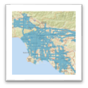_Priority Growth Areas_

The Priority Growth Areas are developed from the following five priority areas based on their ability to support potential mode shift and shorten trip distance. 
* Job Centers ‐ Areas with significantly higher employment density than surrounding areas. Over 60 subareas are identified as having peak job density and capture locally significant job centers throughout all six counties in the region;
* Transit Priority Areas (TPAs) ‐ An area within one‐half mile of a major transit stop that is existing or planned. This includes an existing rail transit station, a ferry terminal served by bus or rail transit service, or the intersection of two or more major bus routes with a frequency of service interval of 15 minutes or less during the morning and afternoon peak commute periods. (Based on CA Public Resources Code Section 21099 (a)(7) and CA Public Resources Code Section 21064.3);
* High Quality Transit Areas (HQTAs) ‐ Areas within one‐half mile of a major transit stop or a high quality transit corridor (a corridor with fixed route bus service containing service intervals no longer than 15 minutes during peak commute hours ‐ based on CA Public Resources Code Section 21155(b));
* Neighborhood Mobility Areas (NMAs) ‐ Areas with high intersection density (generally 50 intersections per square mile or more), low to moderate traffic speeds, and robust residential retail connections that can support the use of Neighborhood Electric Vehicles or active transportation modes for short trips;
* Livable Corridors ‐ This arterial network is a subset of the high quality transit areas based on level of transit service and land use planning efforts, with a few additional arterials identified through corridor planning studies funded through the Sustainability Planning Grant program (currently the Sustainable Communities Program); and
* Spheres of Influence (outside of absolute and variable constrained areas) ‐ Existing or planned service areas and within the planning boundary outside of an agency’s legal boundary; data for these areas was accessed by SCAG from each county’s Local Agency Formation Commission (LAFCO) in 2016.

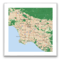_Absolute Constrained Areas_

The growth constraints outlined below were used to articulate where future growth cannot or should not occur. The absolute constraints reflect areas where growth was excluded from the scenario development growth allocation. For the scenario development, growth was not directed into the following areas:
* Tribal Nation Lands – SCAG utilized the Census Bureau’s American Indian/Alaska Native/Native Hawaiian (AIANNH) Areas database for 2017 to identify tribal nations in the SCAG region;
* Military Lands – Locations of military lands are derived from SCAG’s 2016 Existing Land Use Database, which underwent review and refinement by local jurisdictions through the Bottom‐Up Local Input and Envisioning Process;
* Open Space and Conserved Lands – Data on conservation areas, open space, and parks from year 2017 comes from the Save Our Agricultural Resources (SOAR) protected areas in Ventura County, the California Conservation Easement Database, as well as the California Protected Areas Database (CPAD). Together, these data inventories represent protected open space lands, conserved areas, and conservation easements in the SCAG region and the greater State of California. Several elements were developed by aggregating and cross‐checking various open space data from multiple public agencies by GreenInfo Network, and also benefit from feedback provided by local jurisdictions through SCAG’s Bottom‐Up Local Input and Envisioning Process;
* Sea Level Rise Areas (2 feet) – Data on coastal inundation were obtained from the National Oceanic and Atmospheric Administration (NOAA) Coastal Services Center’s online mapping viewer depicting potential sea level rise and its associated impacts on the nation’s coastal areas (accessed by SCAG in 2017). These data depict the potential inundation of coastal areas resulting from a projected 2 feet rise in sea level above current Mean Higher High Water (MHHW) conditions, and underwent review by SCAG’s local jurisdictions; and
* Farmlands in Unincorporated Areas – Farmland information was obtained from the Farmland Mapping & Monitoring Program (FMMP) in the Division of Land Resource Protection in the California Department of Conservation. Established in 1982, the FMMP is to provide consistent and impartial data and analysis of agricultural land use and land use changes throughout the State of California. For SCAG’s purposes, data from year 2016 (and 2014 in areas where 2016 data was unavailable) underwent review and refinement by local jurisdictions through the Bottom‐Up Local Input and Envisioning Process.

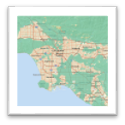_Variable Constrained Areas_

The growth constraints outlined below were used to articulate where future growth cannot or should not occur. Growth will be avoided in following areas, where possible except when constraint conflicts with accommodating the jurisdictional growth total, in the following order:
* Wildland‐Urban Interface (WUI) – Data on areas where housing and vegetation intermingle (“intermix WUI”) and areas with housing in the vicinity of contiguous wildland vegetation (“interface WUI”) were derived from the 2010 national Wildland‐Urban Interface dataset developed by the SILVIS Lab at the University of Wisconsin‐Madison;
* Grazing Lands and Farmlands within Incorporated Jurisdictions – Similar to farmlands identified in unincorporated areas, grazing lands and farmland information within incorporated areas were identified through the Farmland Mapping & Monitoring Program (FMMP) in the Division of Land Resource Protection in the California Department of Conservation, which underwent review by local jurisdictions;
* 500 Year Flood Plains – Information on flood areas were derived from the Digital Flood Insurance Rate Map (DFIRM), obtained from Federal Emergency Management Agency (FEMA) in August 2017. The DFIRM Database is a digital version of the FEMA Flood Insurance Rate Maps (FIRM) that is designed for use with digital mapping and analysis software. The FIRM is created by FEMA for the purpose of floodplain management, mitigation, and insurance activities for the National Flood Insurance Program (NFIP), and was included for local jurisdiction review through SCAG’s Bottom‐Up Local Input and Envisioning Process;
* CalFire Very High Severity Fire Risk (state and local) – Information on areas with very high fire hazards was derived from CalFire’s state responsibility area and local responsibility area Very High Fire Hazard Severity Zone (VHFHSZ) data, accessed by SCAG in early 2019; and
* Natural Lands and Habitat Corridors – Data on habitat corridors was derived from California Essential Habitat Connectivity Project, as developed by the California Department of Fish and Wildlife, which identifies large blocks of intact habitat or natural landscapes with connectivity corridors essential for local wildlife. This dataset benefits from feedback from a selection of federal, state, local, tribal, and non‐governmental organizations throughout California, and was made publicly available in 2010.
