

    

 

# **SCAG Scenario Planning Model (SPM) - Data Management (DM) System**
version Nov. 28, 2017

## _User Guide_

This user guide provides instruction for the user of the SPM Data Management System. This data review and editing framework provides users across the SCAG region with many critical data management and data review options. The SPM Data Management System is accessible via a single web-based application for all jurisdictions in the six-county SCAG region. This documentation covers basic functionality for data review and editing.

## **I.	Introduction**

SCAG Scenario Planning Model (SPM) is a web-based data management, land use planning and modeling platform developed to facilitate more informed and collaborative planning by local jurisdictions and other stakeholders. Built on UrbanFootprint 1.5, an open source modeling platform developed by Calthorpe Analytics in partnership with SCAG and other California public agencies, SPM enables the creation and organization of local and regional data, plan and policies, facilitates scenario creating and editing, and estimates a wide range of potential benefits resulting from alternative transportation and land use strategies.

SPM is currently deployed as two separate web services: Data Management (DM) system and Scenario Development and Analysis (SD) system.  SPM-DM provides a common data framework within which local planning efforts can be easily integrated and synced with regional plans. Using a variety of data management and data review options, the user (local jurisdictions) can explore data, export attributes and edit configured layers.  SPM-SD includes a suite of tools and analytic engines that facilitate scenario creation and editing with advanced analytic capabilities that allow for meaningful comparisons across different land uses and transportation options.

This user guide provides instruction for the user of SPM-DM, covering the basic functionality for data review and editing.

**_System Requirements_**

The SPM is accessed via a web page. For access to the site, there are minimum requirements

* A relatively recent (purchased in last 5 years) desktop or laptop computer running the Windows, Mac OSX, or Linux operating systems. The current system has not been optimized for tablet or touchscreen operating systems or interfaces.

* Current version of Google Chrome web browser. Chrome is available via free download at https://www.google.com/intl/en/chrome/browser/

* Mouse, track-ball, or trackpad-based input device (essentially all desktop or laptop computers have this capability).  

> **_Note:_** If you experience difficulties in performing feature editing (e.g., feature selection, querying, etc.) while being able to view maps on the SPM, first check your internet firewall configuration with your IT support. The URL of the SPM data management site should be added to the trust list of firewall configuration to avoid block access by web filters set up locally.

## **II.	Data Management Framework - Site Map**

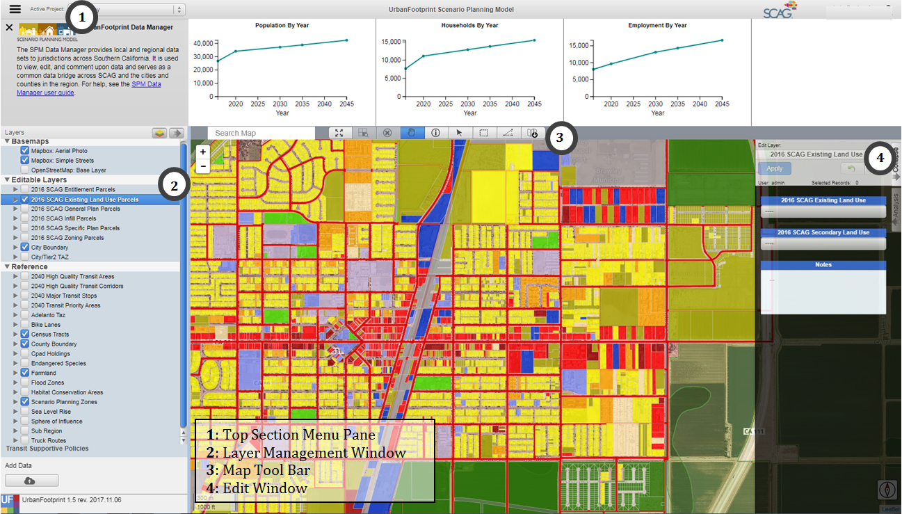

Figure 1: SPM Data Management Framework User Interface

## **III.	User Interface Overview**

### **1. Top Section Menu Pane**

The top section menu drop down allows the user to toggle between Project Info, Data Explorer, and Approval/Merge options. After clicking one of the options, the map selection will resize to display the selected option.

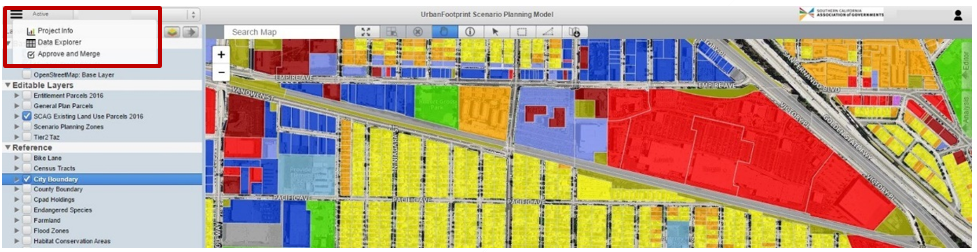

Figure 2: Top Section Menu drop down

**Project Info:** The user can view project information and charts of key demographic statistics.

**Data Explorer:** The user can view and explore data in a table view and define attribute queries and join tables to explore and select data.

**Approval/Merge:** A user with manager or director-level permissions can approve edits and merge those edits into master versions of the editable layers.

#### **_1-1 Project Info_** 

The project info section displays charts on Population, Households, and Employment on the current project. It also includes a link to this User Guide.

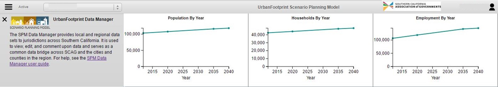

Figure 3: Project Info window

**Tip:** Hover the cursor over the charts to see more detailed information on the data.

#### **_1-2 Data Explorer_** 

The data explorer query functionality and the map selector tools in the SPM are linked by default. When a user selects features on the map with the map selector tools, the attributes will populate in the query table window. If the user inputs an attribute query with no map selection, the map will show the features selected from the attribute query. The user also has the option to use attribute selections and map selections in combination.

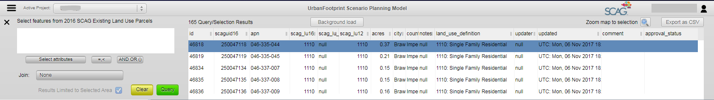

Figure 4: Data Explorer window

* **Querying Attributes:** The user has many options to form their query and to show helpful information in the user interface:

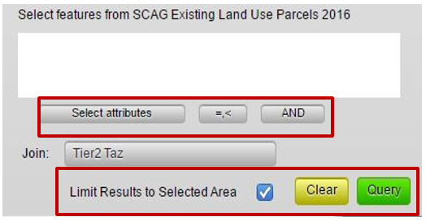

Figure 5: Query options

- _Select Attributes shortcut:_ Allows user to select from a drop down of attributes
- _Operators shortcut:_ Allows user to select operators from a drop-down list
- _AND/OR shortcut:_ Allows user a shortcut to the common AND/OR/parenthesis operators
- _Limit Results to Selected Area:_ If the user has selected features with a map selector tool and input an attribute query, they have the option to limit the query result to the map selection or apply them to the whole dataset.
- _Clear button:_ Clears the selection
- _Query button:_ Executes the query

SPM attribute querying functionality utilizes SQL syntax to tell the database what features the user would like to select. The user can select attribute names from a drop-down list by clicking on the arrow button next to the ‘Where’ clause or type them in.  

_The following comparison/equality operators are supported:_

* Greater than : >
* Less than : <
* Greater than or equal to : >=
* Less than or equal to : <=
* Equals : =
* Not equal: !=

_For querying strings, the following syntax can be used (must be capitals):_

* BEGINS_WITH : String begins with a certain letter or group of letters
* ENDS_WITH : String ends with a certain letter or group of letters
* CONTAINS: String contains a certain letter or group of letters

_Multiple attribute queries are supported using the following syntax (must be capitals):_

* AND : SQL ‘and’ syntax, attributes must meet both query requirements
* OR : SQL ‘or’ syntax, attributes must meet either query requirements

> **Tip:** User can access drop down menu of attributes, operators, and AND/OR/parenthesis syntax for a quicker query.

**Query Examples:**

 **_Example 1_** Return all rows with land use code 1200 with a dwelling unit count greater than 2:

    land_use16 = 1200 AND du>=2

 **_Example 2_** Return all parcels with an apn that begins with 580 or an apn that begins with 104:

    apn BEGINS_WITH "580" OR apn BEGINS_WITH "104"

* **Joining Tables:** SPM allows the user to join and query spatial tables of different geography types and geographic scales. The user utilizes these pre-defined join tables by selecting the desired table from the drop-down button in the query window. Having selected a table to join, the user will have access to all fields in that join table. Any query making use of join fields will utilize the pre-defined spatial or attribute relationship.

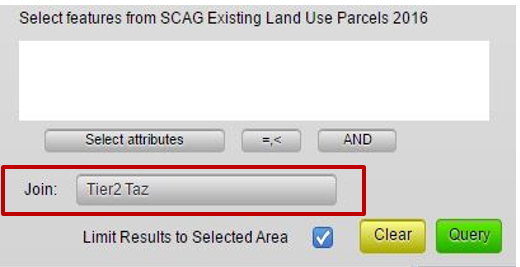

Figure 6: Join tables

>**Important:** If the user is querying a field from the join table that has the same name as a field in the source table, the system defaults to the source table field. To query the join table field, the user must write the *name_of_join_table.field_name* or select it from a drop-down list by clicking the arrow next to the ‘Where’ clause in the Query window.

* **Exporting Query Results:** User can export the current query result to a csv file by clicking on the ‘Export as CSV’ button in the upper right corner of the Data Explorer window.

#### **_1-3 Approve and Merge_** 

The Approve and Merge interface is accessible to users with manager or director-level permissions. The approval interface allows managers to review and approve/reject edits made by any user. Through easy to use drop-down queries, edited features can be reviewed, approved or rejected, and merged into the master version.

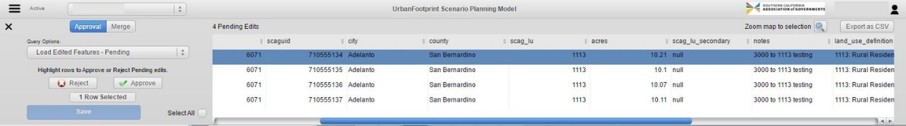

Figure 7: Approve and Merge window

* **_Approving/Rejecting Edits:_** The approval interface acts on the active layer. When a manager is ready to approve or reject edits, he or she can load all pending edited rows (needing approval) by selecting the appropriate query form the drop-down list. If the user would like to review previously approved or rejected features, the system provides those options as well.

Once the data has loaded, the user can highlight a given row (or group of rows by holding down CTRL) and approve or reject the highlighted rows by pushing the corresponding “Approve” and “Reject” buttons. To simply approve or reject all edits, the user can toggle ‘Select All’ to highlight all rows. Once rows have been approved or rejected, the user must save their edits. Any approval or rejections that are not saved will be ignored.

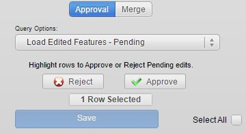

Figure 8: Approval interface

* **_Merging:_** Once features have been reviewed and edits approved, the manager can merge all approved features into the Master version of the layer. Within the approval interface, the user can toggle the Merge screen. This will provide the user with the option to merge approved features. After clicking on the Merge button, a backend process will handle filtering and merging data tables.

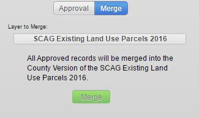

Figure 9: Merging interface

### **2. Layer Management Window**

The Layer Management window on the left side of the SPM user interface displays layers that have been preloaded into the SPM, and that can be turned on for display and activated for selection, editing, and queries. See Appendix A for descriptions of the data available via the SPM.

The Layer Management window consists of 4 sections:
- a. Layer List
- b. Layer Menu
- c. Reordering Layers Menu
- d. Upload

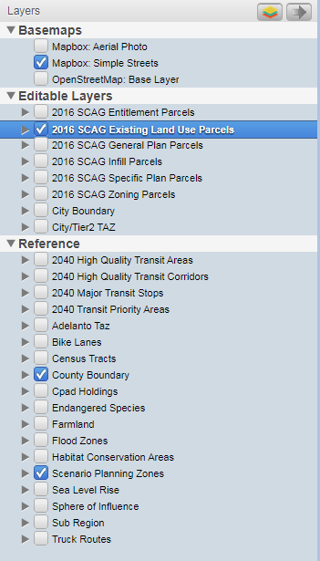

Figure 10: Layer Management window

#### **_2-1	Layers List_**

The Layers List is broken up into 3 sections:
* Basemaps
* Editable Layers
* Reference

Any layer under the Editable Layers section contain fields that can be edited by the user. See Appendix B for the list of fields definitions with editable fields highlighted. For definitions of each of the layers please reference Appendix A.

The user can select an active layer by clicking on the layer name and the active layer will be highlighted in blue.  From the Figure 10 above, SCAG Existing Land Use Parcels is visible on the map (checkbox) and is the active layer (blue highlight).  

> **Important:** Any map selection, attribute query, export layer, export csv initiated by the user will occur on the active layer regardless of it is visible or not.

Each layer’s legend is viewable by clicking on the arrow in front of the layer and then expanding the arrow that appears below the layer.

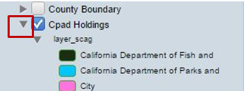

Figure 11: Layer Legend

#### **_2-2	Layer Menu_**

[layers_icon]: <images/scag_10_11_17/layers.png>

The Layers Menu is accessed in the upper right section of the Layer Management Window via the button ![Layers Button][layers_icon]. The Layers Menu has 3 options:

* Export Active Layer to gdb
* Layer Symbology
* Manage Layers

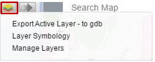

Figure 12: Layer Menu

* **_Exporting Active Layer to gdb:_** The user can initiate exporting by clicking ‘OK’ on a window that opens up once the user clicks on the ‘Export Active Layer – to gdb’ in the drop down.  By default, the exported layer is saved to the user’s default Download folder.

* **_Layer Symbology:_** The Layer symbology allows the user to modify the way a layer is displayed on the map. A user can add new styles, edit previously saved styles, and view the default style for the active layer’s legend. The user can open the Layer Symbology by clicking on the ‘Layer Symbology’ in the drop down.  The default style is set by SCAG and is not editable.

Figure 13: Layer Symbology window

New styles can be added by clicking on the add layer style button  in the Layer Symbology window. By default, all new layers are added with a single symbol. The user can select style type (single, categorical, or quantitative legends) and then attribute, if categorical or quantitative is selected, on which the selected style type is based.

The user can add all unique values of the selected table attribute by clicking on ‘Add All Values’ (for categorical type) or ‘Add All Ranges’ (for quantitative type) button, activated when attribute is selected.

The Layer Symbology window also provides options to edit basic symbol properties such as color, line width and opacity level. To save changes the user must click the save button when finished editing.

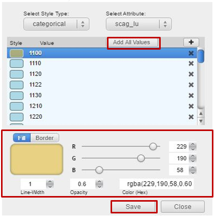

* **_Manage Layers:_** The Manage Layers menu allows users to modify the layers visible in the Layers list. The user can check or uncheck layers here to update the Layer List.

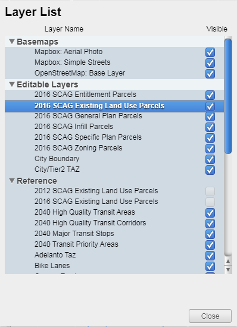

Figure 14: Manage Layers window

#### **_2-3	Reordering Layers Menu_**

[reorder_arrow]: <images/scag_10_11_17/reorder_arrow.png>

The user can re-order layers on the map by clicking on the arrow button ![Reorder Arrow][reorder_arrow] on the right side of the Layers Tool Bar. This button will open a window where the user can re-order the layers by clicking on the layer name and dragging it into the order the user prefers within the visible list. This order corresponds to the layer order on the map.

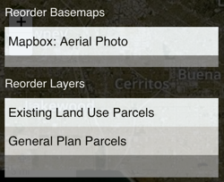

Figure 15: Reordering Layers window

#### **_2-4 Upload_**

Upload geodatabase (.gdb) and shapefiles (.shp) directly into the SPM using the Upload button at the bottom left corner of the page (also see ArcIntegration for importing layers from ArcMap directly to SPM).

Once the upload button is clicked, select the zipped gdb or shapefile in the file selector. The layer will start uploading immediately and is automatically added to the Layer Management Window once completed. Uploaded layers are added as reference layers to the current project and are visible to all users of that project.

Figure 16: Upload button

**Note:** The upload file size limit is 100 MB

### **3. Map Tool Bar**

Clicking on an icon on the map tool bar allows the user to zoom and navigate around the map as well as select and identify map features. The user can hover their pointer to get the ‘tool tip’ to identify what button corresponds with each selector.

[selector_tools]: <images/scag_10_11_17/selector_tools.png>
![Toolbar][selector_tools]

Figure 17: Map Tool bar

[extent_selector]: <images/scag_10_11_17/extent_selector.png>
[zoom_selected]: <images/scag_10_11_17/zoom_selected.png>
[cancel_select]: <images/scag_10_11_17/cancel_select.png>
[hand_select]: <images/scag_10_11_17/hand_select.png>
[info_select]: <images/scag_10_11_17/info_select.png>
[pointer_select]: <images/scag_10_11_17/pointer_select.png>
[box_select]: <images/scag_10_11_17/box_select.png>
[polygon_select]: <images/scag_10_11_17/polygon_select.png>
[download_select]: <images/scag_10_11_17/download_selector.png>

![Zoom to Extent][extent_selector] **_Zoom to Project Extent:_** This tool allows the user to zoom the current map to the project map extent. The project in the SPM refers to a local jurisdiction.

![Zoom to Selection][zoom_selected] **_Zoom to Selection Extent:_** This tool allows the user to zoom the current map to the extent of selected features of the Active Layer.

![Clear Selection][cancel_select] **_Clear Selection:_** This tool clears the selected features of the Active Layer.

![Navigate][hand_select] **_Navigate_:** This tool allows the user to navigate around the map by clicking and dragging on the map. **Tip:** The user can hold ‘Shift’ and drag to create zoom extent.

![Identify][info_select] **_Identify_:** This tool is activated when a feature is selected. The Identify tool opens a moveable summary window where the user can view the attributes of the selected feature.

![Point Selector][pointer_select] **_Point Selector:_** The point selector selects the feature that intersects with a point where the user clicks on the map.

![Rectangle Selector][box_select] **_Rectangle Selector:_** The rectangle selector selects the feature that intersects with a rectangle formed by the user clicking and dragging across the map.

![Polygon Selector][polygon_select] **_Polygon Selector:_** The polygon selector selects the feature that intersects with a user defined polygon shape formed by the user defining each node of the polygon by clicking on the map. Double clicking will stop forming the polygon selection.  

![Download Selector][download_select] **_Export Map:_** The Export Map button takes a snapshot of the current map and downloads the map as a jpg image to the user’s default downloads file.

> **Tip:** ***Multi-select*** can be activated by holding down the CTRL/CMD key (Windows/Mac) for the Point ![Point Selector][pointer_select], Rectangle ![Rectangle Selector][box_select], and Polygon ![Polygon Selector][polygon_select] Selectors.

### **4. Layer Editor**

The Layer Editor allows the user to edit or comment upon select layer attributes. The editable layers are listed in the Layer Management Window under Editable Layers. If a layer is editable, when that layer is active in the layer manager, the user can open the Layer Editor by clicking on the ‘Editor’ button on the right side of the screen to view and edit specific attributes.

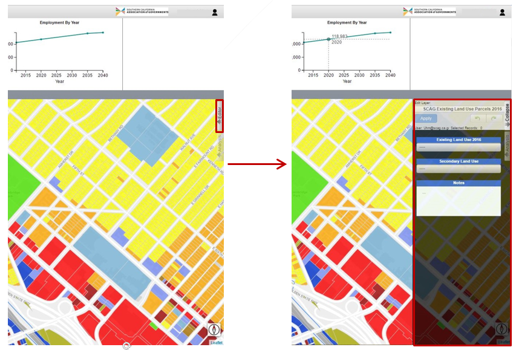

Figure 18: Layer Editor window

The editor operates on the currently selected features of the active layer. If there is more than one feature selected, any changes made in the editor window will populate all rows with those values unless the layer is configured to only allow editing of one row at a time.

In case where a layer is configured to only allow editing of one row at a time (e.g., Tier 2 TAZ), following message will be displayed indicating that only one record at a time can be edited.

The layer attribute drop down allows the user to edit attributes of currently selected features of the active layer and add comments in the notes box associated to that specific edit. To save changes to edited attributes the user must push the apply button when finished editing. If the user changes the selected features without saving changes, those changes will not be saved.

The undo button is activated once changes are saved.

#### **_4-1 Undo / Redo_** 

The undo and redo functionality allows users to undo or redo their most recent changes on the active layer.

*	**_Undo:_** Clicking the undo button will undo the most recently saved change on the active layer regardless of the current selection.

*	**_Redo:_** Clicking the redo button will redo the most recent change that was made using the undo button regardless of the current selection.

**Tip:** If the user hovers of the undo or redo buttons, they will see a message with the above definitions.
