

    

 

    

# SCAG UrbanFootprint Scenario Planning Model (SPM)

## Data Review and Editing User Manual

This user guide provides instruction for the use of the SPM Data Review and Management System. This data review and editing framework, built upon the UrbanFootprint platform, provides users across the SCAG region with a number of critical data management and data review options. The SPM Data Review and Management System is accessible via a single web-based application for all jurisdictions in the six-county SCAG region.  This documentation covers basic functionality for data review and editing. 

## Introduction

SCAG’s UrbanFootprint-based Scenario Planning Model (SPM) is a land use planning, modeling, and data management platform that is undergoing development to facilitate more informed and collaborative planning by SCAG, local jurisdictions, and other key stakeholders.

The SPM Data Review and Management System is being pilot tested to demonstrate how local and regional data can be served to local jurisdictions via the web-based user interface, and to test functions focused primarily on data review and editing. The data review and editing framework within the SPM provides the user with a number of data management and data review options. Using attribute query and map selector tools, the user can explore data, summarize attributes, and edit configured layers.

**System Requirements**

The SPM is accessed via a web page. Ultimately, any web browser will be able to access the system effectively, as will nearly all desktops, laptops, and tablets. For access to the pilot site, there are some more refined, through fairly minimal, requirements: 

* A relatively recent (purchased in last 5 years) desktop or laptop computer running the Windows, Mac OSX, or Linux operating systems. The current system has not been optimized for tablet or touchscreen operating systems or interfaces. 

* Current version of Google Chrome web browser. Chrome is available via free download at https://www.google.com/intl/en/chrome/browser/

* Mouse, track-ball, or trackpad-based input device (essentially all desktop or laptop computers have this capability). 

> **Note:** If you experience difficulties in performing feature editing (e.g., feature selection, querying, etc.) 
> while being able to view maps on the SPM, first check your internet firewall configuration with the local IT support. 
> The URL of the SPM data management site should be added to the trust list of firewall configuration in order to avoid
> block access by web filters set up locally.

## Data Management Framework - Site Map     

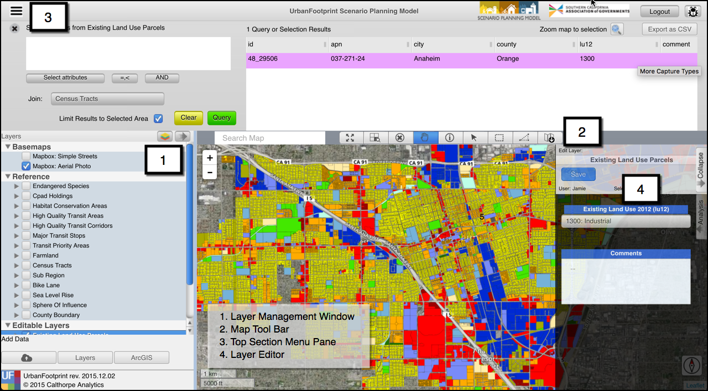

## User Interface Overview 

## 1. Layer Management Window 

The Layer Management window on the left side of the SPM user interface displays layers that have been preloaded into the SPM, and that can be turned on for display and activated for selection, editing, and queries.   

The layer's style legend is viewable by clicking on the arrow next to the layer.

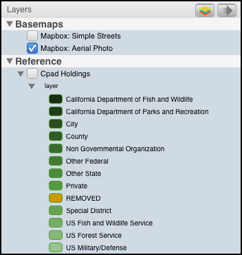

The user can select an active layer by clicking on the layer name and the active layer will be highlighted in blue. 

To view the layer's style, the user can check the checkbox next to the layer name.

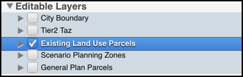
> **Example:** Existing Land Use Parcels is visible on the map (checkbox) and is the active layer (blue highlight).  

**Important:** Any map selection, attribute query, export 
layer, export csv initiated by the user will occur on the 
active layer regardless of whether it is visible or not.

[layers_icon]: <images/scag_12_7_15/layers.png>
[reorder_arrow]: <images/scag_12_7_15/reorder_arrow.png>
[reorder_layers]: <images/scag_12_7_15/reorder_layers.png>

*Editable Layer*: Any layer under the Editable Layers contains editable fields by the user.

![Layers Button][layers_icon] *Exporting Active Layer*: The user can export the Active Layer to a geodatabase (.gdb) by clicking on the layers button on the Layers Tool Bar. The user can initiate exporting by clicking ‘OK’ on a window that opens up (see Figure 3) once the user clicks on the ‘Export Active Layer – to gdb’ button.  By default, the exported layer is saved to the Windows default Download folder. 

![Reorder Arrow][reorder_arrow] *Reordering Map Layers*: The user can re-order layers on the map by clicking on the arrow button on the right side of the Layers Tool Bar. This button will open a window where the user can order the layers by clicking on the layer name and dragging it into the order the user prefers within the visible list. This order corresponds to the layer order on the map. 

![Re-Order Layers][reorder_layers]

## 2. Map Tool Bar

Clicking on an icon on the map tool bar allows the user to zoom and navigate around the map as well as select and identify map features. The user can hover their pointer to get the ‘tool tip’ to identify what button corresponds with each selector. 

[selector_tools]: <images/scag_12_7_15/selector_tools.png>
![Toolbar][selector_tools]

[extent_selector]: <images/scag_12_7_15/extent_selector.png>
[zoom_selected]: <images/scag_12_7_15/zoom_selected.png>
[cancel_select]: <images/scag_12_7_15/cancel_select.png>
[hand_select]: <images/scag_12_7_15/hand_select.png>
[pointer_select]: <images/scag_12_7_15/pointer_select.png>
[box_select]: <images/scag_12_7_15/box_select.png>
[polygon_select]: <images/scag_12_7_15/polygon_select.png>
[info_select]: <images/scag_12_7_15/info_select.png>
[download_select]: <images/scag_12_7_15/download_selector.png>

![Zoom to Extent][extent_selector] *Zoom to Project Extent*: This tool allows the user to zoom the current map to the project map extent. The project in the SPM refers to a local jurisdiction or County.
 
![Zoom to Selection][zoom_selected] *Zoom to Selection Extent*: This tool allows the user to zoom the current map to the extent of selected features of the Active Layer.
 
![Clear Selection][cancel_select] *Clear Selection*: This tool clears the selected features of the Active Layer.
 
![Navigate][hand_select] *Navigate*: This tool allows the user to navigate around the map by clicking and dragging on the map. The user can hold ‘Shift’ and drag to create zoom extent.
 
![Identify][info_select] *Identify*: This tool is activated when a feature is selected. The Identify tool opens a moveable summary window where the user can view the attributes of the selected feature.

![Point Selector][pointer_select] *Point Selector*: The point selector selects the feature that intersects with a point where the user clicks on the map.

![Rectangle Selector][box_select] *Rectangle Selector*: The rectangle selector selects the feature that intersects with a rectangle formed by the user clicking and dragging across the map.
 
![Polygon Selector][polygon_select] *Polygon Selector*: The polygon selector selects the feature that intersects with a user defined polygon shape formed by the user defining each node of the polygon by clicking on the map. Double clicking will stop forming the polygon selection.
  
![Download Selector][download_select] *Export Map*: The Export Map is activated when the user clicks the tool. This will take a snapshot of the current map and download the map as a jpg to the user's default downloads file.

> **Tip:** ***Multi-select*** can be activated by holding down the CTRL/CMD key (Windows/Mac) for the Point ![Point Selector][pointer_select], Rectangle ![Rectangle Selector][box_select], and Polygon ![Polygon Selector][polygon_select] Selectors.

## 3. Top Section Menu Pane

The top section menu drop down allows the user to toggle between Project Info, Data Explorer, and Approval/Merge options. After clicking one of the options, the map selection will resize display the selected option.

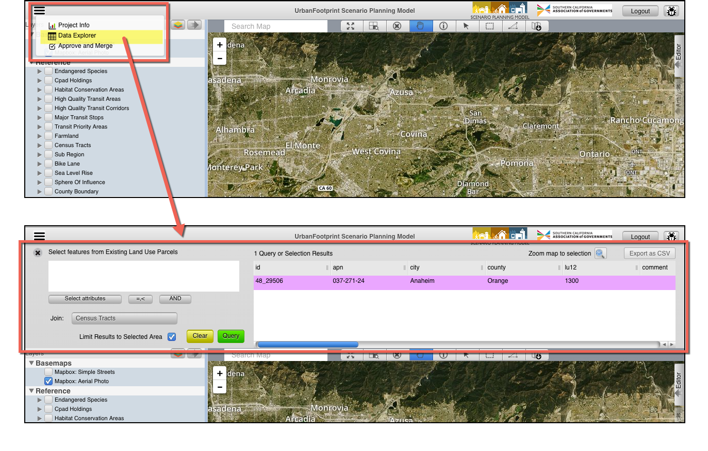

[menu_button]: <images/scag_12_7_15/menu_button.png>
[approval_merge]: <images/scag_12_7_15/approval_icon.png>
[data_explorer]: <images/scag_12_7_15/query.png>
[project_info]: <images/scag_12_7_15/chart_icon.png>

The user can toggle between the following options by clicking on the menu button: 

**Project Info:** The user can switch between Master and Draft Scenarios and see metadata about the active scenario.

**Data Explorer:** The user can define attribute queries and join tables to explore the data.

**Approval/Merge:** The user who has a manager level or director level permission can approve edits and merge those edits into mater versions of the editable layers. 

## 3.1 Project Info ![Project Info][project_info] 

The project info section displays charts on Population, Households, and Employment on the current project.

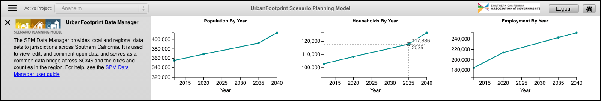
> **Tip:** Hover the cursor over the charts to see more detailed information on the data.
 
## 3.2 Data Explorer ![Data Explorer][data_explorer]  

The data explorer query functionality and the map selector tools in the SPM are linked by default. When a user selects features on the map with the map selector tools, the attributes will populate in the query window. If the user inputs an attribute query with no map selection, the map will show the features selected from the attribute query. The user also has the option to use attribute selections and map selections in combination.  

**Querying Attributes**: 
>SPM attribute querying functionality utilizes SQL syntax to tell the database what features the user would like to select. The user can select attribute names from a drop down list by clicking on the arrow button next to the ‘Where’ clause or type them in.  

*The following comparison/equality operators are supported:* 

* Greater than : >
* Less than : <
* Greater than or equal to : >=
* Less than or equal to : <=
* Equals : =
* Not equal: !=

*For querying strings, the following syntax can be used (must be capitals):* 

* BEGINS_WITH : String begins with a certain letter or group of letters
* ENDS_WITH : String ends with a certain letter or group of letters
* CONTAINS: String contains a certain letter or group of letters

*Multiple attribute queries are supported using the following syntax (must be capitals):*

* AND : SQL ‘and’ syntax, attributes must meet both query requirements
* OR : SQL ‘or’ syntax, attributes must meet either query requirements

> **Tip:** User can access a drop down of attributes, operators, and AND/OR/parenthesis syntax for a quicker query.

**Query Examples:**

 **Example 1**

 Returns all rows with land use code 1200 with a dwelling unit count greater than 2:

    land_use12 = 1200 AND du >= 2

 **Example 2**

 Returns all parcels with an apn that begins with 580 or an apn that begins with 104:

    apn BEGINS_WITH "580" OR apn BEGINS_WITH "104"

>Any string query must have quotation marks around values.

**Joining Tables:**

SPM allows the user to seamlessly join and query spatial tables of different geography types and geographic scales. Each layer in the system is tagged with a join type when it is imported. The join types include attribute joins, polygon to polygon, polygon to centroid, and centroid to polygon joins. This processing is handled ‘behind the scenes’ in the system. 
The user utilizes these pre-defined join tables by selecting the desired table from the drop down button in the query window. Having selected a table to join, the user will have access to all fields in that join table. Any query making use of join fields will utilize the pre-defined spatial or attribute relationship. 

>**Important:** If the user is querying a field from the join table that has the same name as a field in the source table, the system defaults to the source table field.
> To query the join table field, the user must write the *name_of_join_table.field_name* or select it from a drop down list by clicking the arrow next to the 'Where' clause in the Query window.

**Query Options:**

The user has a number of options to form their query and to show helpful information in the user interface:

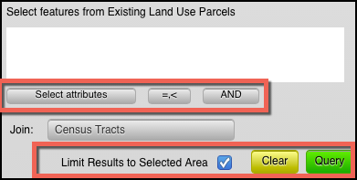

* Limit Results to Selected Area: If the user has selected features with a map selector tool and input an attribute query, they have the option to limit the query result to the map selection or apply them to the whole dataset. 
* Show Selection Shape on Map: The user can toggle on and off the map selection shape 
* Clear Button: Clears the selection
* Query Button: Executes the query
* Select Attributes Shortcut: Allows user to select from a drop down of attributes
* Operators Shortcut: Allows user to select operators from a drop down list
* AND/OR shortcut: Allows user a shortcut to the common AND/OR/parenthesis operators

## 3.3 Approval/Merging ![Approval and Merging][approval_merge] 

The Approval/Merging interface is accessible to users with manager or director level permissions. The approval interface allows data managers to review and approve/reject edits made by any user. Through easy to use drop-down queries, edited features can be reviewed, approved or rejected, and merged into the master version. 

**Approving/Rejecting Edits:** 

The approval interface acts on the active layer. When a data manager is ready to approve or reject edits, they can load all pending edited rows (needing approval) by selecting the correct query form the drop down list. If the user would like to review previously approved or rejected features, the system provides those options as well. 

Once the data has loaded, the user can highlight a given row (or group of rows by holding down CTRL) to see the location on the map. The user can approve or reject the highlighted rows by pushing the corresponding “Approve” and “Reject” buttons. If the user would like to simply approve or reject all edits, toggling ‘Select All’ will highlight all rows. Once highlighted, all rows can then be approved or rejected. Once rows have been approved or rejected, the user must save their edits. Any approval or rejections that are not saved will be ignored. 

**Merging:** 

Once features have been reviewed and edits approved, the data manager can merge all approved features into the Master version of the layer. Within the approval interface, the user can toggle the Merge screen. This will provide the user with the option to merge approved features. After clicking on the Merge button, a backend process will handle filtering and merging data tables. 

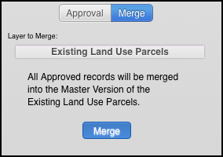

## 4. Layer Editor

The Layer Editor allows the user to edit or comment upon select layer attributes. The editable layers are listed in the Layer Management Window under Editable Layers. If a layer is editable, when that layer is active in the layer manager, the user can open the Layer Editor by clicking on the ‘Editor’ button on the right side of the screen to view and edit specific attributes. 

The editor operates on the currently selected features of the active layer. If there is more than one feature selected, any changes made in the editor window will populate all rows with those values unless the layer is configured to only allow editing of one row at a time. 

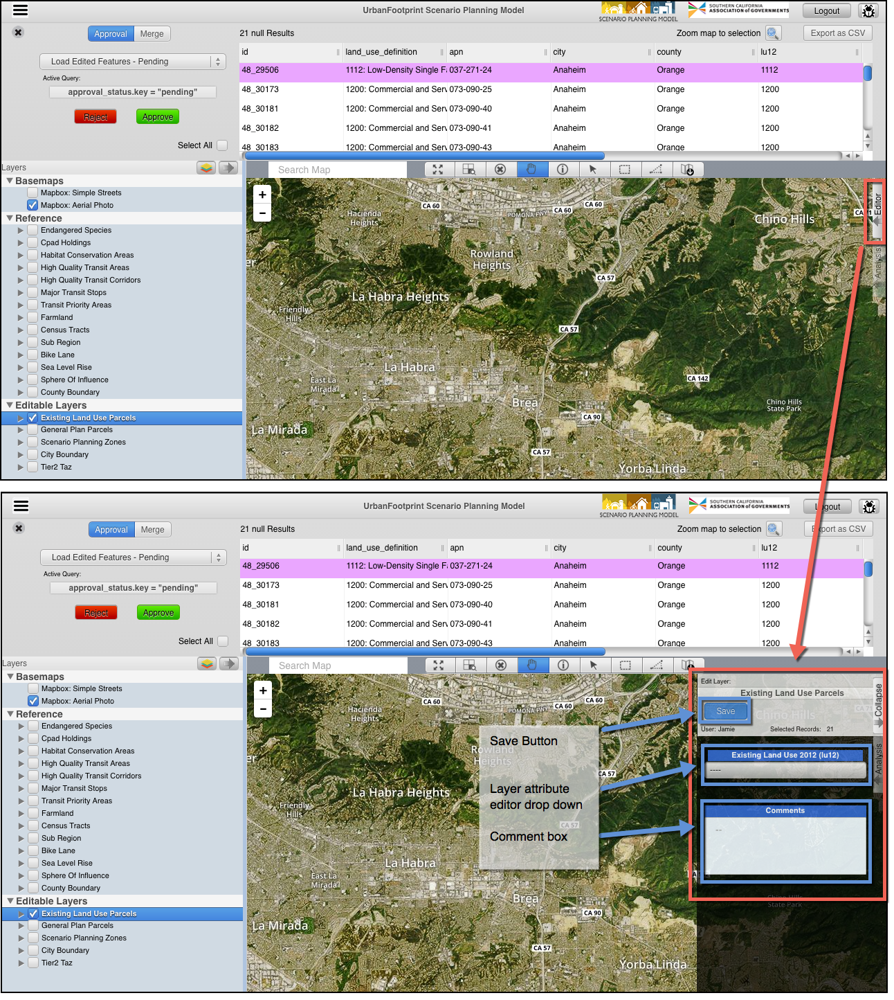

In the case where a layer is configured to only allow editing of one row at a time, the following message will be displayed indicating that only one record at a time can be edited. 

The layer attribute drop down allows the user to edit attributes of currently selected features of the active layer and add comments in the comment box associated to that specific edit.

To save changes to edited attributes the user must push the save button when finished editing. If the user changes the selected features without saving changes, those changes will not be saved. 

## 5. Style Editor

The Style Editor allows the user to add new styles, edit previously saved styles, and view the default style for the active layer's legend. 

To open the Style Editor, the user will click on the layers button ![Layers Button][layers_icon] in the Layer Management Window and selecting 'Layer Symbology' in the drop down.
 
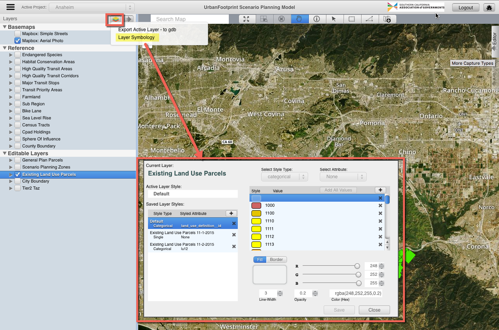

The default style is set by SCAG and is not editable.

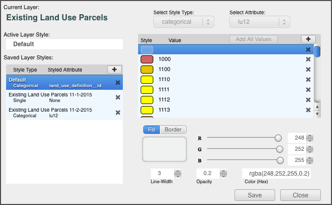

New styles can be added as single, categorical, or quantitative.
 
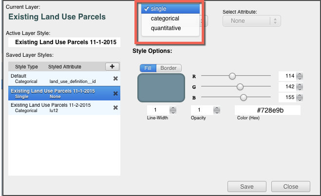 