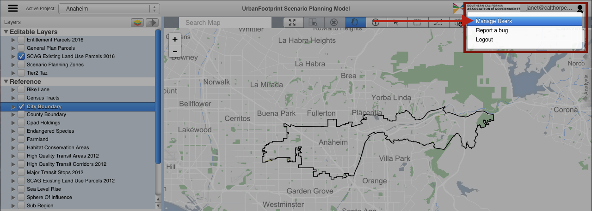
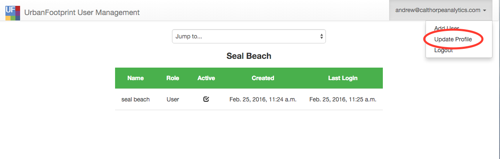

# User Manager

The User Manager allows managers and admin users to manage users in their jurisdiction.

In this section you will find:

* How to update your password
* How to create a new user
* How to update a user's profile

The user manager can be accessed from the user profile dropdown 'Manage Users' in the right hand corner of the SPM.

## How to update your profile

1. In the upper right corner, click on your email address or name to expand the drop down list. From the drop down, select 'Update Profile'.

    

2. Step 2

## How to create a new user

1. Administrative and manager users have the ability to create new users. To add a new user, click on your email address or name in the upper right corner to
expand the drop down list and select 'Add User'.

    

2. Step 2

## How to update a user's profile

1. Administrative and manager users have the ability to update the profiles of users they manage. To modify a user profile, find the user in the list view and
click on that user's row.

2. From the user's profile page, you may edit the following user properties:
    1. Project - Only administrative users have the ability to modify this. This property associates the user to a municipality.
    2. Role
    3. Name
    4. Email
    5. Active
    6. Password
