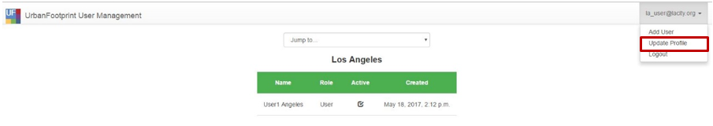
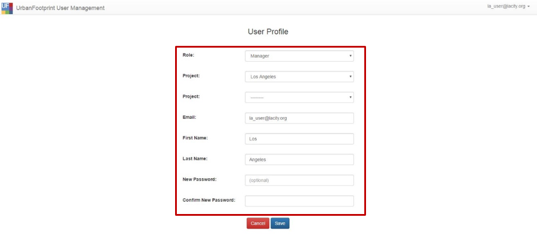
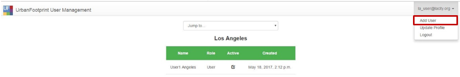
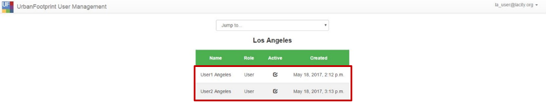

## **V.	User Manager**

The User Manager allows managers and admin users to manage users in their project. Non-manager or non-admin users can update their user profiles. The User Manager can be accessed from the user profile dropdown that appears by clicking on your name. Click on the ‘Manage Users’ to go to the User Management home page.

Figure 20: User Manager

In this section you will find:

* How to update your profile
* How to create a new user
* How to update a user’s profile

### **How to update your profile**

1.	In the upper right corner, click on your email address to expand the drop-down list.  From the drop-down, select ‘Update Profile.’

  

2.	Make the necessary changes to your user profile page and click ‘Save’ to apply the changes, or ‘Cancel’ to cancel.

  

  **Note:** When a change is made to the Project’ drop-down field, the available roles in the ‘Role’ drop-down list will automatically update. Not every role is available to every project. Also not that ‘New Password’ and ‘Confirm New Password’ fields are optional – they should only be completed if you want to reset your password.

### **How to create a new user**

1. Administrative and manager users can create new users. To add a new user, click on your email address in the upper right corner to expand the drop-down list and select ‘Add User’.

2. Complete the following fields:

  

  - _Project_ - This property associates the user to a municipality (or administrative group)
  - _Role_ - The role the user fulfills, e.g. ‘Manager’ or ‘User’
  - _Name_ - This field is optional
  - _Email_ - The email address of the user to be create. It must not already be used for another SPM account
  - _Active_ - If this bow is unchecked, the user will not be able to log in to SPM. It defaults to checked. Uncheck this if a user should not have access to SPM
  - _Password and Confirm Password_ – User who are given a temporary password should log in to this User Manager site and update their password.

3. Click ‘Save’

### **How to update a user’s profile**

1. Administrative and manager users can update the profiles of users they manage. To modify a user profile, find the user in the list view and click on that user’s row.

  

2.	The user’s profile page will show similar fields as those described in ‘How to create a user’, with one difference:

  * _New Password and Confirm New Password_ – These fields are optional and should be set if the user needs to have their password reset.
