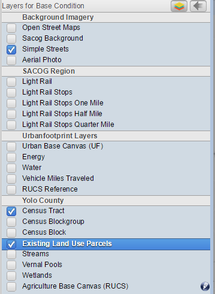

Preliminary User Guide for UrbanFootprint Data Review and Editing
=================================================================

.. |pencil_icon| image:: images/layers_editable.png

The data review and editing framework within UrbanFootprint provides a number of data management and data review features to streamline data updating and review on the web. Using standard GIS and database attribute query and map selector tools, the user can explore data, summarize attributes, and edit configured layers. This documentation covers basic functionality for data review and editing.

Map Layers
==========

The layer management section on the left side of the user interface allows the user to toggle ‘on’ and ‘off’ visible layers and to select the *Active Layer* for selection, querying, and editing.

 + *Active Layer*: The user selects the active layer by clicking on the layer name. The active layer will be highlighted in blue. Any map selection, attribute query, export layer, export csv initiated by the user will occur on the active layer. The user can select an active layer that is not visible on the map. 

 + *Reordering Map Layers*: The user can re-order layers on the map by clicking on the arrow button on the right side of the Layers Tool Bar. This button will open a window where the user can order the layers by clicking on the layer name and ordering it (by dragging it) within the visible list. This order corresponds to the layer order on the map. 

 + Any layer with the pencil |pencil_icon| next to it is editable by the user.

<<<<<<< HEAD

    
    Figure 1: Layers management

Figure 2: Re-order layers

Map Selector Tools
==================
UrbanFootprint provides three Map Selector Tools: a point selector, a box selector, and a polygon selector. The selector tools are located in the tool bar at the top of the map. The user can activate a selector by clicking on the corresponding button and can hover their pointer to get the ‘tool tip’ to identify what button corresponds with each selector.

 *The Selector tool will operate on the Active layer. The selected feature(s) will be highlighted (outlined) in green on the map.*

+ *Point Selector*: The point selector selects the feature that intersects with a point where the user clicks on the map. 
+ *Box Selector*: The box selector selects the feature that intersects with a rectangle formed by the user clicking and dragging across the map.
+ *Polygon Selector*: The polygon selector selects the feature that intersects with a user defined polygon shape formed by the user defining each node of the polygon by clicking on the map. Double clicking will stop forming the polygon selection.

Explore Pane
============
By clicking on the ‘Explore’ button on the top of the screen, the map section will resize and default to the Scenario Manager screen. See Figure 3 below.

Figure 3: Query via Explore top section 

On the left of the Explore Pane, the user can toggle between the following options:

+ **Scenarios:** The user can switch between Base and Future Scenarios and see metadata about the active scenario.
+ **Query:** The user can define attribute queries and join tables to explore the data.
+ **Summarize:** The user can define aggregate queries to summarize the data.

Figure 4: Explore pane options

Scenarios
---------
The default screen when the user clicks on the Explore button goes to Scenarios. This screen allows the user to view and change the active scenario (layer group) and to view top-level demographic characteristics of the current data. By default, when a user logs in, the active scenario is the Base Condition scenario.

Query
-----
UrbanFootprint attribute query functionality can be accessed by clicking on the ‘Explore’ button at the top of the User Interface and then clicking on the ‘Query’ button. See Figure 5 below:

Figure 5: Query window

The attribute query functionality and the map selector tools in UrbanFootprint are linked by default. When a user selects features on the map with the map selector tools, the attributes will populate in the query window. If the user inputs an attribute query with no map selection, the map will show the features selected from the attribute query. The user also has the option to use attribute selections and map selections in combination.

 *Attribute Query*: The UrbanFootprint attribute querying functionality utilizes SQL syntax to tell the database what features the user would like to select.

Figure 6: Query input

*The following comparison/equality operators are supported:*
 
 + Greater than: > 
 + Less than: <
 + Greater than or equal to: >=
 + Less than or equal to: <=
 + Equals: =
 + Not equal: !=

*For querying strings, the following syntax can be used (must be capitals):*

 + BEGINS_WITH : String begins with a certain letter or group of letters
 + ENDS_WITH : String ends with a certain letter or group of letters
 + CONTAINS: String contains a certain letter or group of letters

*Multiple attribute queries are supported using the following syntax (must be capitals):*

 + AND: SQL ‘and’ syntax, attributes must meet both query requirements
 + OR: SQL ‘or’ syntax, attributes must meet either query requirements

*Query Examples:*

 **Example 1**

 Returns all rows with land use code 1200 with a dwelling unit count greater than 2::

    land_use12 = 1200 AND du >= 2

 **Example 2**

 Returns all parcels with an apn that begins with 580 or an apn that begins with 104::

    apn BEGINS_WITH ‘580’ OR apn BEGINS_WITH ‘104’

 *\*Any string query must have quotation marks around values.*

*Joining Tables:* UrbanFootprint allows the user to seamlessly join and query spatial tables of different geography types and geographic scales. Each layer in the system is tagged with a join type when it is imported. The join types include attribute joins, polygon to polygon, polygon to centroid, and centroid to polygon joins. This processing is handled ‘behind the scenes’ in the system.

Figure 7: Join drop-down list

The user utilizes these pre-defined join tables by selecting the desired table from the drop down button in the query window. Having selected a table to join, the user will have access to all fields in that join table. Any query making use of join fields will utilize the pre-defined spatial or attribute relationship. See joins section for further explanation. 

 **Important**: If the user is querying a field from the join table that has the same name as a field in the source table, the system defaults to the source table field. To query the join table field, the user must write the *name_of_join_table.field_name*

*Query Options:* The user has a number of options to form their query and to show helpful information in the user interface.

Figure 8: Query toggles/buttons

 + Limit Results to Selected Area: If the user has selected features with a map selector tool and input an attribute query, they have the option to limit the query result to the map selection or apply them to the whole dataset.
 + Show Selection Shape on Map: The user can toggle on and off the map selection
 + Clear Button: Clears the selection
 + Query Button: Executes the query

Summarize
---------
Similar to querying syntax, aggregation syntax makes use of the SQL database language. The user has options to aggregate any field in the active table and any field in a table that has been joined. Aggregation includes both aggregation operators and ‘group by’ results. The user can also decide whether to aggregate within the active map selection or from the entire dataset.

Figure 9: Aggregation window

 *Aggregation Syntax:* The following aggregation operators are active in UrbanFootprint. 

- SUM(field_name): Sum of the values of the assigned field.
- COUNT(field_name): Count the number rows from the assigned field.
- AVG(field_name): Average of the values of the assigned field. 
- MAX(field_name): Maximum value in the assigned field. 
- MIN(field_name): Minimum value in the assigned field. 

Multiple fields can be aggregated at the same time by separating the aggregation functions with commas. An example of this syntax is as follows::

    SUM(field_name), AVG(field_name2), COUNT(field_name3), SUM(field_name4)

*Group By:* UrbanFooptrint allows the user to specify one or more group by fields. ‘Group By’ allows the user to summarize fields by categorical variables. A common group by field is a parcel land use code column, but any categorical variable can be used. If a group by column is specified, aggregations will return values for each distinct value in the group by column. 

An example of a group by configuration can be seen if Figure 10 below. In this case, the aggregation is to sum all the employment from the TAZ record by unique TAZ id and to count the number of parcels within each TAZ from the parcel data set. The results are also limited to a painted selection.

Figure 10: Aggregation using group by

Attribute Editing
=================
Currently attribute editing requires custom edit forms to be made specifically for configured layers in UrbanFootprint; any layer not configured for editing is not editable. If a layer has been configured, when that layer is active in the layer manager, the user can open an edit window on the right side of the screen to view and edit specific attributes. See figure 11 below:

Figure 11: Attribute editing window 

The editor operates on the currently selected features of the active layer. If there is more than one feature selected, any changes made in the editor widow will populate all rows with those values. In cases where a layer is configured to only allow editing of one row at a time, the following message will be displayed indicating that only one record at a time can be edited:
To save changes to edited attributes the user must push the save button when finished editing. *If the user changes the selected features without saving changes, those changes will not be saved.* See Figure 12 below:

Figure 12: Save button in Managing Urban Built Forms window
